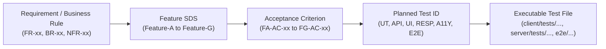

# TokTickIT Lab 2 - Test Design

**Version:** 1.0  
**Status:** Approved Test Design 
**Sprint:** Lab 2 (Requester Ticketing MVP)  
**Product:** TokTickIT  

---

## 1. Purpose and Test Strategy

### 1.1 Purpose
This document defines the comprehensive Test Design and planned verification strategy for **TokTickIT Lab 2 (Requester Ticketing MVP)** prior to implementation. It serves as the authoritative verification contract to ensure that all Functional Requirements (FR-01 through FR-48), Business Rules (BR-01 through BR-41), Non-Functional Requirements (NFR-01 through NFR-12), and Feature Acceptance Criteria (FA-AC-01 through FG-AC-30) defined in `docs/lab-02/specification.md`, `docs/lab-02/api-spec.md`, `docs/lab-02/ui-spec.md`, and the TokTickIT System-Level SDS are systematically verified.

> [!NOTE]
> Where a test depends on a **Proposed UI or API Design Decision** that is still listed as "Requiring Approval" in `ui-spec.md` Section 18 or `api-spec.md` Section 11, the test is explicitly marked **"Pending Design Approval"** in the Coverage Status column. Those tests cannot be finalized until the corresponding decision is approved.

> [!IMPORTANT]
> This document represents **PLANNED TEST DESIGN ONLY**. No tests have been executed, and no tests are claimed to pass yet. All test specifications follow the Test-Driven Development (TDD / Test DD) workflow where tests are designed first, implemented as executable test suites, observed failing against the unbuilt application (Red), and then satisfied by minimal correct implementation (Green).

### 1.2 Multi-Tiered Verification Strategy
The testing pyramid for Lab 2 consists of seven dedicated testing tiers:
1. **Unit Tests (`UT-xxx`):** Fast, isolated tests verifying pure functions, formatting utilities, boundary validators, token parsers, and domain entity invariants.
2. **API / Integration Tests (`API-xxx`):** Backend server integration tests executing against a real test database (PostgreSQL via Prisma), validating HTTP routes, request payloads, response schemas, error envelopes, transactional guarantees, idempotency handling, and ownership isolation.
3. **UI / Component Tests (`UI-xxx`):** React Testing Library tests mounted in jsdom, verifying rendered DOM elements, component state transitions, form inputs, validation triggers, event dispatches, simulated network responses, and client-side error states.
4. **Responsive Tests (`RESP-xxx`):** Layout and usability tests verifying viewport behavior across Mobile ($< 768\text{px}$), Tablet ($768\text{px} - 991\text{px}$), and Desktop ($\ge 992\text{px}$) viewports.
5. **Accessibility Tests (`A11Y-xxx`):** Automated (axe-core) and manual checks targeting WCAG 2.2 AA compliance, visible focus rings, ARIA labels, semantic roles, and color-independent status indications.
6. **End-to-End Tests (`E2E-xxx`):** Full-stack browser automation (Playwright) executing complete multi-step requester user journeys from requester selection to ticket submission, filtering, detail inspection, attachment lifecycle, and requester switching.
7. **Regression Tests (`REG-xxx`):** Baseline checks ensuring that pre-existing Lab 1 capabilities (server health, category querying, initial client boot) remain unbroken.

---

## 2. Test ID Convention

Test identifiers are deterministically assigned using standardized prefixes followed by sequential 3-digit numbers:

| Prefix | Test Tier | Scope & Execution Environment |
|---|---|---|
| `UT-xxx` | Unit Test | Pure logic, helper functions, domain validators, schema validation (Vitest). |
| `API-xxx` | API / Integration Test | Express route handlers, database transactions, HTTP contracts (Supertest / Vitest). |
| `UI-xxx` | UI / Component Test | React components, hooks, form states, user interactions (React Testing Library). |
| `RESP-xxx` | Responsive Layout Test | Viewport layout adaptations, breakpoint overflow, wrapping (Playwright / RTL). |
| `A11Y-xxx` | Accessibility Test | WCAG 2.2 AA compliance, keyboard navigation, focus management, ARIA tags (Axe / Playwright). |
| `E2E-xxx` | End-to-End Test | Full browser user journeys across frontend and backend (Playwright). |
| `REG-xxx` | Regression Test | Baseline Lab 1 verification and system integrity checks (Vitest / Supertest). |

- Every Test ID is strictly unique.
- Every approved Feature Acceptance Criterion maps to at least one Test ID.

---

## 3. Traceability Model



---

## 4. Feature-A Test Plan: Development Requester Context

### 4.1 Scope & Approved Behavior
- Loading active Development Requesters from PostgreSQL via `GET /api/v1/development-requesters`.
- Excluding inactive Development Requesters (e.g., Evan) from selection and restoration.
- Requester selection gate at `/requester-select` before accessing ticketing features.
- Blocking continuation without an active requester selected.
- Storing only the selected Requester ID (UUID) in tab-scoped `sessionStorage`.
- Restoring requester context on page refresh via API validation.
- Handling missing or deactivated stored requester IDs by clearing storage and redirecting to `/requester-select`.
- Change Requester workflow returning to selection, clearing unfinished Create Ticket form state, reloading requester data, and navigating to `/tickets`.
- Displaying clear testing disclaimers (this is NOT authentication; no passwords/JWT).
- Loading, empty, and safe API error retry states.

### 4.2 Planned Tests
| Test ID | Type | Test Scenario & Description | Target Verification | Traceability |
|---|---|---|---|---|
| `API-001` | API | Retrieve active development requesters via `GET /api/v1/development-requesters`. | Returns `200 OK` with array of active requesters (`id`, `name`, `email`). Inactive requesters excluded. Results ordered by `name ASC`. | FR-02, BR-05, FA-AC-01 |
| `API-002` | API | Attempting protected requests with inactive requester header `X-Development-Requester-Id`. | Returns `400 Bad Request` with error code `INACTIVE_REQUESTER`. | FR-06, BR-06, FA-AC-06 |
| `API-003` | API | Attempting protected requests with nonexistent requester UUID header. | Returns `400 Bad Request` with error code `REQUESTER_NOT_FOUND`. | FR-06, BR-06, FA-AC-07 |
| `API-004` | API | Attempting protected requests with malformed (non-UUID) requester header. | Returns `400 Bad Request` with error code `INVALID_REQUESTER_ID`. | NFR-04, FA-AC-07 |
| `API-004B` | API | Attempting protected requests with the `X-Development-Requester-Id` header **absent entirely**. | Returns `400 Bad Request` with error code `MISSING_REQUESTER_HEADER`. | NFR-04, FA-AC-07 |
| `UI-001` | UI | `RequesterSelectScreen` renders active requester options in dropdown with testing disclaimer callout. | Dropdown displays `"Name (email)"`, disclaimer text states Lab 2 testing nature, Continue button is disabled until selection. | FR-01, BR-04, FA-AC-01, FA-AC-02 |
| `UI-002` | UI | `RequesterSelectScreen` blocks submission when no requester is selected. | Inline validation error displayed: *"Please select a development requester."*; `sessionStorage` remains empty. | FA-AC-03 |
| `UI-003` | UI | Selecting an active requester and clicking Continue persists ID in `sessionStorage` and navigates to `/tickets`. | `sessionStorage.getItem('toktickit_requester_id')` equals selected UUID; router navigates to `/tickets`. | FR-03, FR-04, D-L2-01, FA-AC-04 |
| `UI-004` | UI | Page reload with valid requester in `sessionStorage` restores context and renders `AppShell`. | `AppShell` header displays user badge (e.g., `Requester: Alice Developer`); no redirect to `/requester-select`. | FR-04, FA-AC-05 |
| `UI-005` | UI | App initialization with inactive or missing stored requester clears storage and redirects to `/requester-select`. | `sessionStorage` cleared; redirect to `/requester-select` with alert banner explaining requester is no longer available. | FR-06, BR-06, FA-AC-06, FA-AC-07 |
| `UI-006` | UI | Activating `"Change Requester"` in navigation bar executes requester switching. | Navigates to `/requester-select`, clears unfinished form draft state, replaces ID upon re-selection, reloads data. | FR-05, BR-08, D-L2-02, FA-AC-08 |
| `UI-007` | UI | `RequesterSelectScreen` renders loading spinner during fetch and empty state when 0 active requesters exist. | Shows `"Loading active requesters..."` while pending; shows empty alert *"No active Development Requesters are currently available."* when list is empty. | FR-45, FA-AC-09 |
| `UI-008` | UI | `RequesterSelectScreen` renders safe error state with Retry button on API failure. | Shows safe error banner *"Unable to load development requesters. [Retry]"* without internal stack trace. | FR-46, NFR-03, FA-AC-10 |
| `RESP-001`| RESP| `RequesterSelectScreen` layout adapts across desktop, tablet, and mobile viewports. | Form card remains centered without horizontal scroll; buttons and selects remain full width on mobile ($< 768\text{px}$). | FR-47, NFR-01, FA-AC-11 |
| `A11Y-001`| A11Y| `RequesterSelectScreen` keyboard accessibility and visible focus verification. | Dropdown has `<label htmlFor="...">`, Continue button operable via `Enter`/`Space`, focus indicator visible. | FR-48, NFR-02, FA-AC-12 |

---

## 5. Feature-B Test Plan: Requester UI Foundation

### 5.1 Scope & Approved Behavior
- TokTickIT identity and branding follows the approved Zen Green theme, using Primary Green (#006B3C) for primary branding and actions.
- Navigation links for `"My Tickets"` and `"Create Ticket"` with active route highlights.
- Persistent active requester badge (e.g., `Requester: Alice Developer`).
- Change Requester action button in navigation bar.
- Reusable UI state components: `LoadingSpinner`, `ErrorAlert`, `ConfirmModal`.
- Responsive navigation collapsing into a mobile hamburger menu on viewports $< 768\text{px}$.
- Full compliance with the approved Zen Green UI tokens, including Primary Green (#006B3C), Secondary Green (#0B7A46), Pale Green (#EAF6EF), and Page Background (#F5F7F6).
- Accessibility baseline (WCAG 2.2 AA target, semantic HTML, keyboard focus, color independence).

### 5.2 Planned Tests
| Test ID | Type | Test Scenario & Description | Target Verification | Traceability |
|---|---|---|---|---|
| `UI-009` | UI | `AppShell` renders TokTickIT branding, navigation links, and active requester badge. | Brand links to `/tickets`; `"My Tickets"` and `"Create Ticket"` rendered; active badge displays requester name. | FR-44, FB-AC-01, FB-AC-02 |
| `UI-010` | UI | Navigation between requester routes maintains consistent `AppShell` container. | Header persists without remount flickering when transitioning between `/tickets`, `/tickets/new`, and `/tickets/:id`. | FB-AC-03, FB-AC-13 |
| `UI-011` | UI | `LoadingSpinner` component renders accessible loading indicator. | Element contains `role="status"` and accessible text *"Loading content, please wait..."*. | FR-45, FB-AC-04 |
| `UI-012` | UI | `ErrorAlert` component renders safe error message with optional Retry action. | Renders alert card with high-contrast text and dispatches retry callback when clicked. | FR-46, NFR-03, FB-AC-05 |
| `UI-013` | UI | Status and validation indicators convey meaning independently of color alone. | Status badges include textual labels (e.g. `"New"`) alongside icons; error fields render textual error messages. | FR-48, NFR-02, FB-AC-12 |
| `RESP-002`| RESP| `AppShell` top navigation collapses to hamburger menu on mobile viewports ($< 768\text{px}$). | Horizontal links hide; hamburger toggle button displays and opens responsive drawer. | FR-47, NFR-01, FB-AC-08, FB-AC-10 |
| `RESP-003`| RESP| `AppShell` navigation retains full horizontal layout on desktop viewports ($\ge 992\text{px}$). | Brand, links, badge, and Change Requester button render side-by-side without wrapping. | FR-47, NFR-01, FB-AC-08 |
| `A11Y-002`| A11Y| `AppShell` and navigation links support full keyboard navigation with visible focus rings. | `Tab` traverses all navigation items in logical DOM order; active focus outline uses `#0B7A46`. | FR-48, NFR-02, FB-AC-11 |

---

## 6. Feature-C Test Plan: Ticket Reference Data

### 6.1 Scope & Approved Behavior
- `GET /api/v1/categories` returning active categories (e.g., Hardware, Software, Network).
- `GET /api/v1/related-systems` returning active systems (Campus Wi-Fi, VPN, Email, LEB2, SIS, Printing Service, University Laptop).
- Excluding inactive categories and related systems from new selection endpoints.
- Database seed idempotency (repeated seed executions do not produce duplicates).
- Historical inactive reference preservation (historical tickets preserve and render inactive category/system names with `(Inactive)` indicator).
- Backend rejection (`400 Bad Request`) if a new ticket submission contains an inactive or invalid Category or Related System ID.

### 6.2 Planned Tests
| Test ID | Type | Test Scenario & Description | Target Verification | Traceability |
|---|---|---|---|---|
| `API-005` | API | `GET /api/v1/categories` returns list of active categories. | Returns `200 OK` with JSON array `[{ id, name, isActive: true }]`; inactive categories excluded. | FR-42, BR-38, FC-AC-01 |
| `API-006` | API | `GET /api/v1/related-systems` returns list of active related systems. | Returns `200 OK` with JSON array `[{ id, name, isActive: true }]`; inactive systems excluded. | FR-42, BR-38, FC-AC-02 |
| `API-007` | API | Database seeding creates initial required active Related Systems. | Seed populates Campus Wi-Fi, VPN, Email, LEB2, Student Information System, Printing Service, Laptop. | D-L2-14, FC-AC-03 |
| `API-008` | API | Database seeding execution is strictly idempotent. | Re-running seed script produces no duplicate records or unique constraint violations. | NFR-07, FC-AC-04 |
| `API-009` | API | Deactivating a Category or Related System does not corrupt or delete existing associated Tickets. | Existing ticket record maintains foreign key association and retrieves inactive reference name. | FR-43, BR-39, FC-AC-05, FC-AC-06 |
| `API-010` | API | Backend returns `400 Bad Request` if new ticket payload contains an inactive Category ID. | Error response code `INACTIVE_CATEGORY`; ticket creation is aborted. | BR-38, NFR-04, FC-AC-08 |
| `API-011` | API | Backend returns `400 Bad Request` if new ticket payload contains an inactive Related System ID. | Error response code `INACTIVE_RELATED_SYSTEM`; ticket creation is aborted. | BR-38, NFR-04, FC-AC-08 |
| `API-012` | API | Backend returns `400 Bad Request` if Category ID or Related System ID is invalid / nonexistent UUID. | Error response code `INVALID_CATEGORY` or `INVALID_RELATED_SYSTEM`. | NFR-04, FC-AC-08 |
| `API-013` | API | Reference data endpoints return `200 OK` with empty array if 0 active records exist. | Valid JSON response `[]`; downstream consumers handle gracefully without crashing. | FC-AC-09 |
| `API-014` | API | Reference data endpoints return safe `500 Internal Server Error` on unexpected database failure. | Safe error envelope with code `SERVER_ERROR`; no SQL queries or DB connection strings exposed. | NFR-03, FC-AC-10 |
| `REG-001` | REG | Lab 1 Category model, routes, and baseline data remain fully operational. | Lab 1 baseline tests and `GET /api/categories` continue to pass without regressions. | NFR-09, FC-AC-11 |

---

## 7. Feature-D Test Plan: Create Ticket

### 7.1 Scope & Approved Behavior
- Form fields: Category (select), Related System (select), Requested Priority (radio/select, default `Medium`), Summary (5–120 chars), Description (10–2000 chars), Staged Attachments (optional).
- System-generated read-only values: Requester Name, Ticket Number (`TKT-YYYY-NNNNN`), Ticket Date (UTC), Status `New`.
- String trimming on Summary and Description; rejection of whitespace-only input.
- Authoritative backend duplicate-submission prevention via `clientRequestId` (UUID v4 in request body).
  - First valid submission: `201 Created`.
  - Exact replay with same `clientRequestId` and matching payload: `200 OK` with header `Idempotent-Replay: true`.
  - Replay with same `clientRequestId` but conflicting payload: `409 Conflict` (`IDEMPOTENCY_CONFLICT`).
- Concurrent ticket creation safety ensuring transactional annual sequence uniqueness.
- Client-side form submission busy state (button disabled, text `"Submitting Ticket..."`).
- Preserving entered user form values upon recoverable validation or server errors.
- Navigation to `/tickets/:ticketId` upon creation with success toast notification.
- Attachment staging and upload lifecycle: Ticket created first; staged attachments uploaded via attachment API; partial attachment failures do not roll back the ticket.

### 7.2 Planned Tests
| Test ID | Type | Test Scenario & Description | Target Verification | Traceability |
|---|---|---|---|---|
| `UT-001` | Unit | Summary validator accepts trimmed string between 5 and 120 characters. | Returns valid for length 5, 50, 120; returns invalid for length 4, 121. | BR-13, FD-AC-04, FD-AC-05 |
| `UT-002` | Unit | Summary validator rejects whitespace-only strings (e.g. `"     "`). | Trimmed length is 0; returns validation error *"Summary must be between 5 and 120 characters."*. | BR-13, FD-AC-08 |
| `UT-003` | Unit | Description validator accepts trimmed string between 10 and 2000 characters. | Returns valid for length 10, 500, 2000; returns invalid for length 9, 2001. | BR-14, FD-AC-06, FD-AC-07 |
| `UT-004` | Unit | Description validator rejects whitespace-only strings. | Trimmed length is 0; returns validation error *"Description must be between 10 and 2000 characters."*. | BR-14, FD-AC-08 |
| `UT-005` | Unit | Priority validator validates allowed vocabulary (`Low`, `Medium`, `High`, `Urgent`) and defaults to `Medium`. | Rejects invalid strings (e.g., `"Critical"`); defaults to `Medium` if undefined. | BR-11, FD-AC-03 |
| `UT-006` | Unit | Ticket Number generator produces format `TKT-YYYY-NNNNN`. | Matches regex `^TKT-\d{4}-\d{5}$` (e.g., `TKT-2026-00001`). | FR-10, BR-02, FD-AC-15 |
| `API-015` | API | `POST /api/v1/tickets` creates a valid ticket with `201 Created`. | Returns created ticket JSON with `id`, `ticketNumber`, `currentStatus: "New"`, `requestedPriority: "Medium"`, UTC `createdAt`. | FR-09, FR-11, FR-12, FD-AC-13, FD-AC-15, FD-AC-16, FD-AC-17 |
| `API-016` | API | Created ticket is strictly associated with the active Development Requester in header. | Database record `requesterId` matches `X-Development-Requester-Id` header. | FR-09, BR-07, FD-AC-14 |
| `API-017` | API | Idempotent replay of `POST /api/v1/tickets` with identical `clientRequestId` and payload. | Returns `200 OK` with header `Idempotent-Replay: true` and identical ticket representation; no duplicate DB row. | FR-14, BR-16, FD-AC-18 |
| `API-018` | API | `POST /api/v1/tickets` with reused `clientRequestId` but different payload returns `409 Conflict`. | Returns `409 Conflict` with error code `IDEMPOTENCY_CONFLICT`. | FR-14, BR-16, FD-AC-18 |
| `API-019` | API | Concurrent ticket submissions generate strictly unique sequential Ticket Numbers. | 10 parallel requests in same calendar year produce sequential numbers without duplicates or collisions. | NFR-06, FD-AC-19 |
| `API-020` | API | `POST /api/v1/tickets` rejects Summary $< 5$ chars or $> 120$ chars with `400 Bad Request`. | Error code `VALIDATION_ERROR` with field-specific message. | BR-13, BR-15, FD-AC-04, FD-AC-05 |
| `API-021` | API | `POST /api/v1/tickets` rejects Description $< 10$ chars or $> 2000$ chars with `400 Bad Request`. | Error code `VALIDATION_ERROR` with field-specific message. | BR-14, BR-15, FD-AC-06, FD-AC-07 |
| `API-022` | API | `POST /api/v1/tickets` rejects missing required fields (`categoryId`, `relatedSystemId`, `summary`, `description`). | Returns `400 Bad Request` listing missing required properties. | NFR-04, FD-AC-01 |
| `API-023` | API | `POST /api/v1/tickets` returns safe `500 Internal Server Error` on database connection loss. | Safe error envelope with code `SERVER_ERROR`; no stack trace exposed. | NFR-03, FD-AC-23 |
| `UI-014` | UI | `CreateTicketScreen` renders all required fields with read-only system headers. | Renders Requester name (read-only), Category select, Related System select, Priority radio group, Summary, Description. | FR-07, BR-10, FD-AC-01, FD-AC-02 |
| `UI-015` | UI | Requested Priority defaults to `Medium` on initial form mount. | Radio button / option `Medium` is checked by default. | BR-11, D-L2-05, FD-AC-03 |
| `UI-016` | UI | Dynamic character count indicators on Summary and Description fields. *(Depends on Proposed UI Decision UI-5 — real-time character counters.)* | If approved: Summary indicator displays `0 / 120`; Description indicator displays `0 / 2000`, updating in real time. Approved baseline: form fields display 5–120 / 10–2000 char limits in the field label or helper text. | Proposed UI-5, FD-AC-01 |
| `UI-017` | UI | Client-side validation triggers on submit without dispatching API request if inputs are invalid. | Inline error messages displayed under invalid fields; `fetch`/API mock is not invoked. | BR-15, NFR-04, FD-AC-04, FD-AC-06 |
| `UI-018` | UI | Submitting valid form places button in disabled busy state (`"Submitting Ticket..."`). | Submit button is disabled; loading indicator shown; inputs set to read-only during transmission. | BR-16, FD-AC-20 |
| `UI-019` | UI | Form preserves entered values when API returns a 400 or 500 error. | User-entered Summary, Description, and selections remain intact in form inputs; error alert displayed at top. | FR-15, BR-17, FD-AC-21, FD-AC-22 |
| `UI-020` | UI | Successful creation navigates to `/tickets/:ticketId` and displays success toast. | Router pushes to ticket detail route; toast shows *"Ticket TKT-YYYY-NNNNN created successfully!"*. | FR-16, D-L2-17, FD-AC-24 |
| `UI-021` | UI | Partial upload failure on create-time staged attachments preserves ticket and displays warning. | Navigates to `/tickets/:ticketId`; warning banner displayed *"Ticket created, but some attachments failed to upload."*. | BR-36, FD-AC-25 |
| `RESP-004`| RESP| `CreateTicketScreen` form controls stack responsively on mobile viewports ($< 768\text{px}$). | Form controls stack in single-column layout; submit button expands to full width. | FR-47, NFR-01, FD-AC-26 |
| `A11Y-003`| A11Y| `CreateTicketForm` accessibility: labels, ARIA invalid states, and keyboard navigation. | `<label>` linked via `htmlFor`; invalid fields set `aria-invalid="true"` and `aria-describedby="[error-id]"`. Character count indicators, if rendered, must announce updates via `aria-live="polite"` (contingent on Proposed UI-5 approval). | FR-48, NFR-02, FD-AC-27 |

---

## 8. Feature-E Test Plan: My Tickets

### 8.1 Scope & Approved Behavior
- Requester ownership scoping: Requester A views strictly Requester A's tickets; Requester B's tickets never appear.
- Search input (`q`): Case-insensitive match across `ticketNumber`, `summary`, and `description`, debounced by ~300 ms on UI.
- Filters: `categoryId`, `relatedSystemId`, `requestedPriority`, `currentStatus`, combined using logical `AND`.
- Sorting: `newest` (default), `oldest`, `recentlyUpdated`, `ticketNumberAsc` with deterministic tie-breaking.
- Pagination: 1-indexed `page`, page sizes `10` (default), `20`, `50`. Changing search, filter, sort, or page size resets to `page=1`.
- Distinct states: Loading skeleton, True Empty (0 total tickets with `[+ Create Ticket]` CTA), Query No-Results (0 matches with `[Clear Filters]` CTA), and Safe Failure (Retry banner).
- Responsive view: Desktop tabular view ($\ge 992\text{px}$). Mobile/tablet adaptation method is subject to Proposed UI Design Decision UI-2 (see ui-spec.md Section 18.2).

### 8.2 Planned Tests
| Test ID | Type | Test Scenario & Description | Target Verification | Traceability |
|---|---|---|---|---|
| `UT-007` | Unit | Query string builder correctly serializes search, filters, sort, and pagination parameters. | Produces `?page=1&pageSize=10&sortBy=newest&q=vpn&categoryId=...`. | BR-19, FE-AC-12 |
| `API-024` | API | `GET /api/v1/tickets` returns only tickets belonging to requester in `X-Development-Requester-Id`. | Results contain only tickets where `requesterId` matches header; other requesters' tickets excluded. | FR-17, BR-07, BR-18, FE-AC-01, FE-AC-02 |
| `API-025` | API | `GET /api/v1/tickets?q=TKT-2026-00001` searches by exact and partial Ticket Number. | Returns matching ticket; case-insensitive. | FR-18, BR-20, FE-AC-03, FE-AC-06 |
| `API-026` | API | `GET /api/v1/tickets?q=vpn` searches case-insensitively across Summary and Description. | Returns tickets containing `"VPN"`, `"vpn"`, or `"GlobalProtect"` in summary or description. | FR-18, BR-20, FE-AC-04, FE-AC-05, FE-AC-06 |
| `API-027` | API | `GET /api/v1/tickets?categoryId=...` filters tickets by specific Category ID. | Returns only tickets matching specified category. | FR-19, BR-21, FE-AC-07 |
| `API-028` | API | `GET /api/v1/tickets?relatedSystemId=...` filters tickets by Related System ID. | Returns only tickets matching specified related system. | FR-19, BR-21, FE-AC-08 |
| `API-029` | API | `GET /api/v1/tickets?requestedPriority=High` filters tickets by priority. | Returns only tickets with `requestedPriority: "High"`. | FR-19, BR-21, FE-AC-09 |
| `API-030` | API | `GET /api/v1/tickets?currentStatus=New` filters tickets by status. | Returns only tickets with `currentStatus: "New"`. | FR-19, BR-21, FE-AC-10 |
| `API-031` | API | Multiple filter parameters combine with logical `AND`. | `?categoryId=...&requestedPriority=High` returns only tickets matching both conditions. | FR-19, BR-21, FE-AC-11 |
| `API-032` | API | Search query `q` combines with active filters with logical `AND`. | Returns only tickets matching search term AND all active filters. | BR-19, FE-AC-12 |
| `API-033` | API | Default sorting `sortBy=newest` returns newest created tickets first with tie-break. | Orders by `createdAt DESC`, tie-broken by `ticketNumber ASC`. | FR-20, BR-08, D-L2-08, FE-AC-13 |
| `API-034` | API | Sorting options `oldest`, `recentlyUpdated`, `ticketNumberAsc` order results deterministically. | Validates correct SQL `ORDER BY` execution for each approved sort enum value. | FR-20, FE-AC-14 |
| `API-035` | API | Pagination defaults to `page=1` and `pageSize=10` with correct pagination metadata. | Response includes `{ page: 1, pageSize: 10, totalItems: 25, totalPages: 3, hasNextPage: true, hasPreviousPage: false }`. | FR-21, D-L2-09, FE-AC-15 |
| `API-036` | API | Supported page sizes `20` and `50` return correct slice of tickets. | `pageSize=20` returns up to 20 tickets; `pageSize=50` returns up to 50 tickets. | FR-21, D-L2-09, FE-AC-16 |
| `API-037` | API | `GET /api/v1/tickets` returns `400 Bad Request` on invalid pagination or sort parameter. | Returns error code `INVALID_QUERY_PARAMS` for `page=0`, `pageSize=15`, or `sortBy=invalid`. | NFR-04, FE-AC-21 |
| `UI-022` | UI | `MyTicketsScreen` debounces search input by ~300 ms before dispatching fetch. | Rapid keystrokes dispatch only one API request after 300 ms idle. | D-L2-24, FE-AC-06 |
| `UI-023` | UI | Modifying search, filter, sort, or page size immediately resets active page to Page 1. | Page pagination highlight returns to 1; request dispatches `page=1`. | BR-22, FE-AC-17 |
| `UI-024` | UI | True Empty state renders when requester owns 0 tickets total. | Renders *"No Tickets Found"*, *"You have not submitted any IT support tickets yet."*, and `[+ Create Ticket]` CTA button. | FR-22, BR-40, D-L2-16, FE-AC-18 |
| `UI-025` | UI | Query No-Results state renders when tickets exist but none match active filters. | Renders *"No Matching Tickets"*, *"No tickets match your search and filter criteria."*, and `[Clear Filters]` CTA button. | FR-23, BR-40, D-L2-16, FE-AC-19 |
| `UI-026` | UI | Clicking `[Clear Filters]` resets all filter dropdowns and search input to default and refetches. | Search input cleared, selects reset to `"All ..."`, results reload. | FR-23, FE-AC-19 |
| `UI-027` | UI | Clicking a ticket row/card navigates to `/tickets/:ticketId`. | Router pushes to ticket detail view for clicked ticket UUID. | FE-AC-22 |
| `RESP-005`| RESP| `MyTicketsScreen` renders 8-column data table on desktop ($\ge 992\text{px}$). | Table displays Ticket #, Summary, Category, System, Priority, Status, Attachments, Date. | FR-47, NFR-01, FE-AC-24 |
| `RESP-006`| RESP| `MyTicketsScreen` remains usable without horizontal page overflow on mobile/tablet ($< 992\text{px}$). *(Exact presentation depends on Proposed UI Decision UI-2 — mobile ticket card transformation.)* | Approved baseline: No horizontal window scroll; all tickets reachable. If Proposed UI-2 is approved: table transforms into stacked Ticket Cards; if rejected: alternative responsive treatment verified instead. | Proposed UI-2, FR-47, NFR-01, FE-AC-24 |
| `A11Y-004`| A11Y| `MyTicketsScreen` table accessibility, filter labels, and pagination keyboard operability. | Table has `<th>` scope headers; filter selects have explicit `<label>` tags; pagination buttons operable via keyboard. | FR-48, NFR-02, FE-AC-25 |

---

## 9. Feature-F Test Plan: Requester Ticket Detail

### 9.1 Scope & Approved Behavior
- Detailed inspection of requester-owned ticket: Ticket Number, localized Ticket Date, Requester identity, Category, Related System, Requested Priority, Summary, Description, Status `New`.
- Read-only presentation: All submitted ticket fields rendered as static cards/text without editable form controls.
- Localized date/time display (formatted in user's local locale).
- Display of historical inactive Category or Related System with subtle `(Inactive)` badge.
- Neutral `404 Not Found` response on backend for nonexistent tickets AND cross-requester tickets (no disclosure of another requester's ticket existence).
- Neutral UI "Ticket Not Found" screen with `[<- Return to My Tickets]` CTA.
- Separate integration area for Feature-G Attachment Management.
- Scope enforcement: Omission of IT Staff controls, public comments, internal notes, actions taken, and status changes.

### 9.2 Planned Tests
| Test ID | Type | Test Scenario & Description | Target Verification | Traceability |
|---|---|---|---|---|
| `API-038` | API | `GET /api/v1/tickets/:ticketId` returns full ticket detail for owned ticket. | Returns `200 OK` with complete ticket DTO including active/tombstone attachment arrays. | FR-24, FF-AC-01, FF-AC-04 |
| `API-039` | API | `GET /api/v1/tickets/:ticketId` returns `404 Not Found` for nonexistent ticket UUID. | Returns `404 Not Found` with code `TICKET_NOT_FOUND` and safe neutral message. | FR-27, BR-24, D-L2-10, FF-AC-08 |
| `API-040` | API | `GET /api/v1/tickets/:ticketId` returns identical neutral `404 Not Found` for ticket owned by another requester. | Returns `404 Not Found` with code `TICKET_NOT_FOUND`; zero disclosure that ticket exists for another requester. | FR-26, FR-27, BR-24, D-L2-10, FF-AC-07, FF-AC-09, FF-AC-10 |
| `API-041` | API | `GET /api/v1/tickets/:ticketId` returns `400 Bad Request` on malformed (non-UUID) ticket ID parameter. | Returns `400 Bad Request` with code `INVALID_TICKET_ID`. | NFR-04, FF-AC-12 |
| `UI-028` | UI | `TicketDetailScreen` renders all ticket fields as read-only presentation without editable input controls. | Verified absence of `<input>`, `<textarea>`, or edit action buttons for ticket header fields. | FR-25, BR-25, D-L2-26, FF-AC-02, FF-AC-04 |
| `UI-029` | UI | Ticket Date renders in user's local locale format. | Date string is formatted locally (e.g. `"September 4, 2026, 10:30 PM"`). | BR-10, FF-AC-04 |
| `UI-030` | UI | Inactive historical Category or Related System renders with a clear secondary indicator. *(Exact presentation depends on Proposed UI Decision UI-4 — inactive reference indicator.)* | Approved baseline: Inactive reference name accompanied by a clear secondary label (e.g. `(Inactive)`). If Proposed UI-4 is approved: rendered as a secondary pill badge `[Category Name] (Inactive)`. | FR-43, BR-39, Proposed UI-4, FF-AC-05, FF-AC-06 |
| `UI-031` | UI | Neutral "Ticket Not Found" view renders when API returns 404. | Renders *"Ticket Not Found"*, *"The requested ticket does not exist or you do not have permission to view it."*, and `[<- Return to My Tickets]` link. | FR-27, BR-24, D-L2-23, FF-AC-08, FF-AC-09, FF-AC-13 |
| `UI-032` | UI | `TicketDetailScreen` strictly excludes out-of-scope IT Staff and status controls. | Confirmed no public comments, internal notes, status transition dropdowns, or assignment controls. | FF-AC-16 |
| `RESP-007`| RESP| `TicketDetailScreen` stacks overview and description cards cleanly on mobile viewports ($< 768\text{px}$). | Long description text wraps without overflowing card boundaries; back link remains visible. | FR-47, NFR-01, FF-AC-17 |
| `A11Y-005`| A11Y| `TicketDetailScreen` semantic structure, heading hierarchy (`<h1>`), and focus management. | Page uses single `<h1>`, `<section>` landmarks, visible focus on back navigation link. | FR-48, NFR-02, FF-AC-18 |

---

## 10. Feature-G Test Plan: Attachment Management

### 10.1 Scope & Approved Behavior
- Allowed file types: JPG/JPEG (`image/jpeg`), PNG (`image/png`), WEBP (`image/webp`), PDF (`application/pdf`).
- Detected content type / content signature validation on backend matching declared extension.
- Size constraint: $\le 5\text{ MB} = 5,242,880\text{ bytes}$ per file.
- Active file capacity: Maximum 5 active attachments per ticket. Soft-removed tombstones do NOT count toward the 5-file cap.
- Mixed selection logic: The backend iterates submitted files in order. For each file: invalid format → rejected, oversized → rejected, capacity reached → rejected, otherwise → accepted. The response always returns `201 Created` with `accepted[]` and `rejected[]` arrays; only if **all** files are rejected does the endpoint return `400 Bad Request` (`NO_VALID_FILES`).
- Original filename handling: Duplicate original filenames allowed; storage keys use generated unique UUIDs.
- Ownership protection: Cross-requester upload, metadata fetch, preview, download, and removal return neutral `404 Not Found`.
- Image preview behavior for JPG, PNG, WEBP: approved requirement is that an owned active image can be previewed. Exact presentation (modal vs navigation) depends on Proposed UI Decision UI-3.
- PDF Open / Download behavior (`target="_blank"` or direct download; no custom embedded canvas viewer).
- Direct file download (`inline=false`).
- Soft-removal workflow (`DELETE /api/v1/tickets/:ticketId/attachments/:attachmentId`):
  - Confirmation modal required.
  - Trimmed removal `reason` required (1–200 characters; whitespace-only rejected). The request body field name is `reason`.
  - Database metadata retained as tombstone with `isRemoved: true`, removal timestamp, remover ID, and reason.
  - `ATTACHMENT_REMOVED` audit event recorded.
  - Binary object deleted from storage; physical cleanup failure never restores user visibility.
  - Removed attachments cannot be previewed, opened, or downloaded (`404 Not Found` with code `ATTACHMENT_NOT_FOUND`).
  - Active capacity slot is immediately freed upon removal.

### 10.2 Planned Tests
| Test ID | Type | Test Scenario & Description | Target Verification | Traceability |
|---|---|---|---|---|
| `UT-008` | Unit | Attachment extension & declared MIME validator accepts `.jpg`, `.jpeg`, `.png`, `.webp`, `.pdf`. | Returns valid for allowed extensions; returns invalid for `.exe`, `.zip`, `.mp4`, `.docx`. | FR-29, BR-26, FG-AC-01, FG-AC-02, FG-AC-03 |
| `UT-009` | Unit | Attachment file size validator accepts $\le 5\text{ MB}$ and rejects $> 5\text{ MB}$. | Accepts $5,242,880\text{ bytes}$; rejects $5,242,881\text{ bytes}$. | FR-30, BR-27, FG-AC-04, FG-AC-05 |
| `UT-010` | Unit | Removal reason validator requires trimmed string between 1 and 200 characters. | Accepts length 1, 100, 200; rejects length 0 (whitespace-only) and length 201. | BR-32, D-L2-12, FG-AC-18, FG-AC-19 |
| `API-042` | API | `POST /api/v1/tickets/:ticketId/attachments` uploads a single valid image/PDF file ($\le 5\text{ MB}$). | Returns `201 Created` with envelope `{ data: { accepted: [...], rejected: [], activeAttachmentCount } }`; binary stored in object storage. | FR-28, FR-29, FR-30, FG-AC-01, FG-AC-02, FG-AC-10 |
| `API-043` | API | `POST /api/v1/tickets/:ticketId/attachments` with an unsupported file type (e.g. `.exe`) as the only submitted file. | Returns `400 Bad Request` with error code `NO_VALID_FILES` (all submitted files rejected). | FR-29, BR-26, FG-AC-03 |
| `API-044` | API | `POST /api/v1/tickets/:ticketId/attachments` with a single oversized file ($> 5\text{ MB}$) as the only submitted file. | Returns `400 Bad Request` with error code `NO_VALID_FILES` (all submitted files rejected). | FR-30, BR-27, FG-AC-05 |
| `API-045` | API | `POST /api/v1/tickets/:ticketId/attachments` when ticket already has 5 active files and 1 new file is submitted. | Returns `400 Bad Request` with error code `NO_VALID_FILES` (capacity exhausted, all rejected). | FR-31, BR-28, FG-AC-06 |
| `API-046` | API | Partial capacity upload: Ticket has 4 active files; submit 2 valid files simultaneously. | Returns `201 Created` with `accepted` array containing the 1st file (filling the last slot) and `rejected` array containing the 2nd file with reason `"Ticket attachment limit reached (maximum 5 active attachments)."`; `activeAttachmentCount` becomes 5. | D-L2-31, FG-AC-07 |
| `API-046B` | API | Mixed selection: 1 valid file and 1 invalid format file submitted together; ticket has capacity. | Returns `201 Created` with `accepted` array containing the valid file and `rejected` array with the invalid file and reason `"Unsupported file format."`; `activeAttachmentCount` increments by 1. | FR-32, BR-37, FG-AC-08 |
| `API-047` | API | Uploading files with identical original filenames creates distinct records without overwrite. | Both attachments saved with distinct UUID primary keys and storage paths. | FR-33, BR-30, D-L2-18, FG-AC-09 |
| `API-048` | API | `GET /api/v1/tickets/:ticketId/attachments/:id` returns metadata for owned active attachment. | Returns `200 OK` with `{ id, originalFilename, mimeType, sizeBytes, isRemoved: false, removedAt: null, removalReason: null, createdAt }`. | FR-34, FG-AC-11 |
| `API-049` | API | `GET /api/v1/tickets/:ticketId/attachments/:id` returns `404 Not Found` for cross-requester access. | Returns neutral `404 Not Found` (`ATTACHMENT_NOT_FOUND`); no data disclosed. | FR-26, BR-24, FG-AC-12 |
| `API-050` | API | `GET /api/v1/tickets/:ticketId/attachments/:id/download?inline=true` streams binary for preview. | Returns `200 OK` with image binary, correct `Content-Type`, and `Content-Disposition: inline; filename="..."`. | FR-35, FG-AC-13, FG-AC-15 |
| `API-051` | API | `GET /api/v1/tickets/:ticketId/attachments/:id/download?inline=false` streams binary for download. | Returns `200 OK` with binary and `Content-Disposition: attachment; filename="..."`. | FR-34, FR-36, FG-AC-13, FG-AC-16 |
| `API-052` | API | Download endpoint returns `404 Not Found` for cross-requester attachment download attempt. | Returns neutral `404 Not Found` with code `ATTACHMENT_NOT_FOUND`; no binary streamed. | FR-26, BR-24, FG-AC-14 |
| `API-053` | API | `DELETE /api/v1/tickets/:ticketId/attachments/:id` soft-removes attachment with valid `reason` body field. | Returns `200 OK` tombstone DTO with `isRemoved: true`, `removedAt` timestamp, `removalReason` populated; `ATTACHMENT_REMOVED` audit event created in same transaction. | FR-37, FR-39, FR-40, BR-31, BR-32, BR-33, FG-AC-20 |
| `API-054` | API | `DELETE /api/v1/tickets/:ticketId/attachments/:id` rejects whitespace-only or absent `reason` field. | Returns `400 Bad Request` with code `INVALID_REMOVAL_REASON`. | BR-32, FG-AC-18, FG-AC-19 |
| `API-055` | API | `DELETE /api/v1/tickets/:ticketId/attachments/:id` triggers storage binary deletion. | Storage binary is deleted; database tombstone record is retained with full metadata. | FR-41, BR-35, FG-AC-24 |
| `API-056` | API | Binary cleanup failure during removal does not restore user visibility. | Attachment remains `isRemoved: true`; download/preview endpoint returns `404 Not Found` with code `ATTACHMENT_NOT_FOUND`; cleanup error is logged server-side. | FR-41, FG-AC-25 |
| `API-057` | API | Download/preview requests for a soft-removed attachment return `404 Not Found`. | Attempt to download removed attachment returns `404 Not Found` with code `ATTACHMENT_NOT_FOUND` (binary permanently deleted). | FR-40, BR-34, FG-AC-22 |
| `API-058` | API | Removing an attachment frees an active slot, allowing subsequent upload up to cap. | Ticket with 5 active attachments: after removing 1 (`DELETE`), a new upload succeeds and `activeAttachmentCount` returns to 5. | BR-29, FG-AC-23 |
| `API-059` | API | Attempting to delete another requester's attachment returns neutral `404 Not Found`. | Returns `404 Not Found` with code `ATTACHMENT_NOT_FOUND`; record is not modified. | FR-26, BR-24, FG-AC-26 |
| `API-060` | API | Calling `DELETE` on an already-removed attachment returns `409 Conflict`. | Returns `409 Conflict` with code `ATTACHMENT_ALREADY_REMOVED`. | NFR-04, FG-AC-20 |
| `UI-033` | UI | `AttachmentSection` renders active attachments list, upload control, and active capacity count. | Displays `Attachments (X / 5 active)` and allowed formats notice. Upload control renders; drag-and-drop target is contingent on Proposed UI-7 approval. | FR-28, FR-31, FG-AC-10 |
| `UI-034` | UI | Selecting mixed files accepts valid files and shows individual per-file rejection feedback for invalid ones. | Valid files staged/uploaded; invalid file shows clear per-file rejection message (e.g. *"installer.exe: Unsupported format"*). | FR-32, BR-37, D-L2-21, FG-AC-08 |
| `UI-035` | UI | Clicking `[Preview]` on an owned active image file opens an in-app preview. *(Exact modal presentation depends on Proposed UI Decision UI-3 — Image Preview Presentation.)* | Approved baseline: image content is viewable without leaving the ticket context. If Proposed UI-3 approved: accessible modal opens with close button and `Esc` dismissal. | FR-35, D-L2-22, Proposed UI-3, FG-AC-15 |
| `UI-036` | UI | Clicking `[Open / Download]` on PDF triggers direct download or browser tab open (`target="_blank"`). | PDF binary opened/downloaded; no custom canvas PDF viewer rendered. | FR-36, D-L2-22, FG-AC-16 |
| `UI-037` | UI | Clicking `[Remove]` opens a confirmation interaction requiring a removal reason. | User is prompted for a required reason (1–200 chars). Confirmation and cancellation actions available. Character counter on reason field contingent on Proposed UI-5. | FR-38, FR-39, BR-31, BR-32, FG-AC-17, FG-AC-18 |
| `UI-038` | UI | Confirming removal moves attachment to collapsible "Removed Attachments (History)" section. | Active count decrements; tombstone item displays filename, removal timestamp, and removal reason. | FR-40, BR-33, FG-AC-20, FG-AC-21 |
| `RESP-008`| RESP| `AttachmentSection` and removal confirmation adapt responsively across desktop and mobile. | Attachment list rows are usable without overflow on mobile; removal confirmation fits within mobile viewport. | FR-47, NFR-01, FG-AC-29 |
| `A11Y-006`| A11Y| Removal confirmation and image preview interactions are keyboard accessible. | Removal confirmation: focus trapped inside while open; `Esc` cancels; reason textarea linked to explicit label. Image preview accessibility (focus trap, `Esc` dismiss) is contingent on Proposed UI-3 approval. | FR-48, NFR-02, FG-AC-30 |

---

## 11. API Test Inventory

| Test ID | Endpoint | Method | Scenario | Preconditions | Input Payload / Params / Headers | Expected Status | Expected Response / Behavior | Traceability |
|---|---|---|---|---|---|---|---|---|
| `API-001` | `/api/v1/development-requesters` | GET | List active requesters | Database seeded | None | `200 OK` | Array of active requesters (`id`, `name`, `email`), ordered by `name ASC` | FR-02, FA-AC-01 |
| `API-004B` | `/api/v1/tickets` (any protected) | POST | Missing requester header | Alice active | Header absent | `400 Bad Request` | Error code `MISSING_REQUESTER_HEADER` | NFR-04, FA-AC-07 |
| `API-005` | `/api/v1/categories` | GET | List active categories | Categories seeded | None | `200 OK` | Array of active categories (`id`, `name`), ordered by `name ASC` | FR-42, FC-AC-01 |
| `API-006` | `/api/v1/related-systems` | GET | List active related systems | Systems seeded | None | `200 OK` | Array of active systems (`id`, `name`), ordered by `name ASC` | FR-42, FC-AC-02 |
| `API-015` | `/api/v1/tickets` | POST | Create valid ticket | Alice active, valid refs | `X-Development-Requester-Id: Alice.id`, valid body + `clientRequestId` | `201 Created` | Created ticket JSON (`ticketNumber: "TKT-2026-00001"`, `currentStatus: "New"`) | FR-09, FD-AC-13 |
| `API-017` | `/api/v1/tickets` | POST | Exact replay of creation | Ticket already created | Same `clientRequestId` and identical payload | `200 OK` | `Idempotent-Replay: true` header, identical ticket JSON | FR-14, FD-AC-18 |
| `API-018` | `/api/v1/tickets` | POST | Idempotency conflict | `clientRequestId` exists | Reused `clientRequestId` with altered Summary | `409 Conflict` | Error code `IDEMPOTENCY_CONFLICT` | FR-14, FD-AC-18 |
| `API-010` | `/api/v1/tickets` | POST | Inactive category submitted | Inactive Category ID | `categoryId: inactive.id` | `400 Bad Request` | Error code in `VALIDATION_ERROR` details for `categoryId` field | BR-38, FC-AC-08 |
| `API-011` | `/api/v1/tickets` | POST | Inactive system submitted | Inactive System ID | `relatedSystemId: inactive.id` | `400 Bad Request` | Error code in `VALIDATION_ERROR` details for `relatedSystemId` field | BR-38, FC-AC-08 |
| `API-020` | `/api/v1/tickets` | POST | Summary validation error | Alice active | `summary: "abc"` ($< 5$ chars) | `400 Bad Request` | Error code `VALIDATION_ERROR`, field `"summary"` | BR-13, FD-AC-04 |
| `API-021` | `/api/v1/tickets` | POST | Description validation error | Alice active | `description: "too short"` ($< 10$ chars) | `400 Bad Request` | Error code `VALIDATION_ERROR`, field `"description"` | BR-14, FD-AC-06 |
| `API-024` | `/api/v1/tickets` | GET | List owned tickets | Alice & Bob have tickets | `X-Development-Requester-Id: Alice.id` | `200 OK` | Paginated ticket array containing only Alice's tickets | FR-17, FE-AC-01 |
| `API-025` | `/api/v1/tickets` | GET | Search by Ticket Number | Alice owns tickets | `?q=TKT-2026-00001` | `200 OK` | Filtered ticket array matching query | FR-18, FE-AC-03 |
| `API-031` | `/api/v1/tickets` | GET | Combined filter query | Alice owns varied tickets | `?categoryId=...&requestedPriority=High` | `200 OK` | Tickets matching all filter parameters | FR-19, FE-AC-11 |
| `API-033` | `/api/v1/tickets` | GET | Default sorting order | Alice owns multiple tickets | None (`sortBy` defaults to `newest`) | `200 OK` | Sorted `createdAt DESC`, tie-break `ticketNumber ASC` | FR-20, FE-AC-13 |
| `API-035` | `/api/v1/tickets` | GET | Pagination execution | Alice owns 25 tickets | `?page=1&pageSize=10` | `200 OK` | 10 tickets + pagination metadata (`totalPages: 3`) | FR-21, FE-AC-15 |
| `API-038` | `/api/v1/tickets/:ticketId` | GET | Get owned ticket detail | Alice owns ticket | `X-Development-Requester-Id: Alice.id`, `:ticketId: AliceTicket.id` | `200 OK` | Full ticket DTO + attachments array | FR-24, FF-AC-01 |
| `API-039` | `/api/v1/tickets/:ticketId` | GET | Nonexistent ticket detail | Alice active | `:ticketId: random-uuid` | `404 Not Found` | Neutral error code `TICKET_NOT_FOUND` | FR-27, FF-AC-08 |
| `API-040` | `/api/v1/tickets/:ticketId` | GET | Cross-requester ticket detail | Alice owns ticket | `X-Development-Requester-Id: Bob.id`, `:ticketId: AliceTicket.id` | `404 Not Found` | Neutral error code `TICKET_NOT_FOUND` (no disclosure) | FR-26, FF-AC-09 |
| `API-042` | `/api/v1/tickets/:ticketId/attachments` | POST | Upload single valid file | Alice owns ticket | Multipart `files`: `screenshot.png` (1 MB) | `201 Created` | `{ data: { accepted: [AttachmentDTO], rejected: [], activeAttachmentCount: N } }` | FR-28, FG-AC-01 |
| `API-043` | `/api/v1/tickets/:ticketId/attachments` | POST | Reject invalid file format (only file) | Alice owns ticket | Multipart `files`: `script.sh` | `400 Bad Request` | Error code `NO_VALID_FILES` | FR-29, FG-AC-03 |
| `API-044` | `/api/v1/tickets/:ticketId/attachments` | POST | Reject oversized file (only file) | Alice owns ticket | Multipart `files`: `dump.pdf` (6 MB) | `400 Bad Request` | Error code `NO_VALID_FILES` | FR-30, FG-AC-05 |
| `API-045` | `/api/v1/tickets/:ticketId/attachments` | POST | Capacity exhausted (only file) | Ticket has 5 active files | Multipart `files`: `extra.png` | `400 Bad Request` | Error code `NO_VALID_FILES` | FR-31, FG-AC-06 |
| `API-046` | `/api/v1/tickets/:ticketId/attachments` | POST | Partial capacity: 2 valid files, 1 slot remaining | Ticket has 4 active files | Multipart `files`: `a.png`, `b.png` | `201 Created` | `accepted: [a.png]`, `rejected: [{ filename: "b.png", reason: "Ticket attachment limit reached..." }]`, `activeAttachmentCount: 5` | D-L2-31, FG-AC-07 |
| `API-046B` | `/api/v1/tickets/:ticketId/attachments` | POST | Mixed: 1 valid + 1 invalid format, capacity available | Alice owns ticket, < 5 active | Multipart `files`: `photo.png`, `script.exe` | `201 Created` | `accepted: [photo.png]`, `rejected: [{ filename: "script.exe", reason: "Unsupported file format..." }]` | FR-32, BR-37, FG-AC-08 |
| `API-048` | `/api/v1/tickets/:ticketId/attachments/:id` | GET | Get attachment metadata | Alice owns ticket & file | `:ticketId: AliceTicket.id`, `:id: Attachment.id` | `200 OK` | Attachment metadata JSON (`isRemoved: false`, `removedAt: null`, `removalReason: null`) | FR-34, FG-AC-11 |
| `API-049` | `/api/v1/tickets/:ticketId/attachments/:id` | GET | Cross-requester metadata | Alice owns file | `X-Development-Requester-Id: Bob.id`, `:id: AliceAtt.id` | `404 Not Found` | Neutral error code `ATTACHMENT_NOT_FOUND` | FR-26, FG-AC-12 |
| `API-050` | `/api/v1/tickets/:ticketId/attachments/:id/download` | GET | Stream image for preview | Alice owns file | `?inline=true` | `200 OK` | Image binary stream, `Content-Disposition: inline; filename="..."` | FR-35, FG-AC-15 |
| `API-051` | `/api/v1/tickets/:ticketId/attachments/:id/download` | GET | Download attachment file | Alice owns file | `?inline=false` | `200 OK` | Binary stream, `Content-Disposition: attachment; filename="..."` | FR-34, FG-AC-13 |
| `API-052` | `/api/v1/tickets/:ticketId/attachments/:id/download` | GET | Cross-requester download | Alice owns file | `X-Development-Requester-Id: Bob.id`, `?inline=false` | `404 Not Found` | Neutral error code `ATTACHMENT_NOT_FOUND` | FR-26, FG-AC-14 |
| `API-053` | `/api/v1/tickets/:ticketId/attachments/:id` | DELETE | Soft-remove with valid reason | Alice owns file | Body: `{ "reason": "Uploaded wrong image" }` | `200 OK` | Tombstone DTO (`isRemoved: true`, `removalReason` populated) | FR-37, FG-AC-20 |
| `API-054` | `/api/v1/tickets/:ticketId/attachments/:id` | DELETE | Reject whitespace-only reason | Alice owns file | Body: `{ "reason": "   " }` | `400 Bad Request` | Error code `INVALID_REMOVAL_REASON` | BR-32, FG-AC-18 |
| `API-057` | `/api/v1/tickets/:ticketId/attachments/:id/download` | GET | Block download of removed file | File soft-removed | `?inline=false` on removed attachment | `404 Not Found` | Error code `ATTACHMENT_NOT_FOUND` | FR-40, FG-AC-22 |
| `API-059` | `/api/v1/tickets/:ticketId/attachments/:id` | DELETE | Cross-requester removal | Alice owns file | `X-Development-Requester-Id: Bob.id` | `404 Not Found` | Neutral error code `ATTACHMENT_NOT_FOUND` | FR-26, FG-AC-26 |

---

## 12. UI / Component Test Inventory

Planned React Component test files mapped to `client/tests/lab-02/`:

### 12.1 `CreateTicket.test.tsx`
- `UI-014`: Render all form fields with read-only system generated info.
- `UI-015`: Validate default Requested Priority is `Medium`.
- `UI-016`: Character limit indicators on Summary and Description. *(Approved baseline: char limits visible in labels/helper text. Real-time counter DOM assertions are contingent on Proposed UI-5 approval.)*
- `UI-017`: Form submission blocked with inline errors when fields are invalid.
- `UI-018`: Submit button enters busy state (`"Submitting Ticket..."`) and is disabled during request.
- `UI-019`: Preserving entered form values upon 400/500 API failure.
- `UI-020`: Navigation to `/tickets/:ticketId` and success toast on creation.
- `UI-021`: Warning banner displayed when create-time staged attachments fail upload.

### 12.2 `MyTickets.test.tsx`
- `UI-022`: Search input debounced by 300 ms before dispatching request.
- `UI-023`: Changing search, filter, sort, or page size resets pagination to Page 1.
- `UI-024`: True Empty state renders when requester owns 0 tickets with `[+ Create Ticket]` CTA.
- `UI-025`: Query No-Results state renders when 0 tickets match active filters with `[Clear Filters]` CTA.
- `UI-026`: Clicking `[Clear Filters]` resets all filters and reloads tickets.
- `UI-027`: Clicking a ticket row/card navigates to ticket detail.

### 12.3 `RequesterTicketDetail.test.tsx`
- `UI-028`: Render all submitted ticket fields as read-only text cards.
- `UI-029`: Localized date formatting for ticket creation timestamp.
- `UI-030`: Inactive historical Category/System accompanied by a clear secondary indicator. *(Approved baseline: a clear secondary label such as `(Inactive)` is present. Exact pill/badge DOM assertions are contingent on Proposed UI-4 approval.)*
- `UI-031`: Neutral "Ticket Not Found" view rendered on 404 response with return link.
- `UI-032`: Verification that out-of-scope IT Staff controls, comments, and notes are omitted.

### 12.4 `AttachmentSection.test.tsx`
- `UI-033`: Render active attachments list, upload control, and active capacity counter (`X / 5 active`). *(Approved baseline: upload button and capacity count present. Drag-and-drop target assertions are contingent on Proposed UI-7 approval.)*
- `UI-034`: Mixed selection feedback: valid files staged, invalid files show individual per-file rejection messages.
- `UI-035`: Clicking `[Preview]` on an owned active image makes image content viewable in-context. *(Approved baseline: image is viewable without leaving the ticket. Modal-specific assertions — open/close behavior, `Esc` dismiss — are contingent on Proposed UI-3 approval.)*
- `UI-036`: PDF Open/Download action triggers browser download / new tab.
- `UI-037`: Removal confirmation modal requires trimmed removal reason (1–200 chars).
- `UI-038`: Confirmed removal moves item to "Removed Attachments (History)" section.

### 12.5 `RequesterSelect.test.tsx` & `AppShell.test.tsx`
- `UI-001` - `UI-008`: Development Requester selection, validation, persistence, restoration, switching, loading, and safe error states.
- `UI-009` - `UI-013`: `AppShell` branding, persistent navigation, requester badge, and reusable state components.

---

## 13. Server API Test File Mapping

Planned server-side integration test files mapped to `server/tests/lab-02/`:

| Planned Server Test File | Target Endpoints & Scope | Primary Mapped Tests |
|---|---|---|
| `create-ticket.api.test.ts` | `POST /api/v1/tickets` | `API-015`, `API-016`, `API-017`, `API-018`, `API-019`, `API-020`, `API-021`, `API-022`, `API-023` |
| `my-tickets.api.test.ts` | `GET /api/v1/tickets` | `API-024`, `API-025`, `API-026`, `API-027`, `API-028`, `API-029`, `API-030`, `API-031`, `API-032`, `API-033`, `API-034`, `API-035`, `API-036`, `API-037` |
| `ticket-detail.api.test.ts` | `GET /api/v1/tickets/:ticketId` | `API-038`, `API-039`, `API-040`, `API-041` |
| `attachments.api.test.ts` | `/api/v1/tickets/:ticketId/attachments*` | `API-042`, `API-043`, `API-044`, `API-045`, `API-046`, `API-047`, `API-048`, `API-049`, `API-050`, `API-051`, `API-052`, `API-053`, `API-054`, `API-055`, `API-056`, `API-057`, `API-058`, `API-059`, `API-060` |
| `development-requesters.api.test.ts` | `GET /api/v1/development-requesters` | `API-001`, `API-002`, `API-003`, `API-004` |
| `reference-data.api.test.ts` | `GET /api/v1/categories`, `GET /api/v1/related-systems` | `API-005`, `API-006`, `API-007`, `API-008`, `API-009`, `API-010`, `API-011`, `API-012`, `API-013`, `API-014` |

---

## 14. E2E Test Plan

Planned test suite: `e2e/lab-02/requester-ticket-flow.spec.ts`

### Complete Requester User Journey Scenario (`E2E-001`)
1. **Initial Access:** User navigates to root URL `/`; application detects empty `sessionStorage` and displays `/requester-select`.
2. **Requester Selection:** User selects `"Alice Developer (alice@kmutt.ac.th)"` and clicks `"Continue"`.
3. **Landing on My Tickets:** Application sets tab-scoped `sessionStorage` and navigates to `/tickets` displaying Alice's ticket dashboard.
4. **Open Create Ticket:** User clicks `"Create Ticket"` action in top navigation; route transitions to `/tickets/new`.
5. **Form Population & Reference Data:** Verify Category and Related System dropdowns are loaded from the backend.
6. **Data Entry:** User selects Category `"Hardware"`, Related System `"Campus Wi-Fi"`, keeps default Priority `"Medium"`, enters Summary `"Wi-Fi disconnects in Building CB2"`, and enters Description `"Signal drops every 10 minutes when roaming between APs."`.
7. **Stage Attachment:** User stages permitted image `error_log.png` (1 MB).
8. **Submit Ticket:** User clicks `"Submit Ticket"`; verify submit button enters disabled busy state (`"Submitting Ticket..."`).
9. **Receive Official Number:** Backend creates ticket, assigns `TKT-2026-00001`, uploads attachment, and redirects to `/tickets/:ticketId`.
10. **Verify Read-Only Detail:** User inspects Ticket Detail; confirms Ticket Number, Localized Date, Status `"New"`, Requester `"Alice Developer"`, and read-only text fields.
11. **Verify Attachment:** Confirms `error_log.png` appears in active attachments list with preview and download actions.
12. **Return to My Tickets:** User clicks `"My Tickets"` navigation link; verifies `TKT-2026-00001` appears in the ticket list.
13. **Search & Filter:** User searches `"CB2"`; confirms `TKT-2026-00001` is returned. User filters by Priority `"Urgent"`; confirms no-results state is displayed. User clicks `"Clear Filters"`; ticket reappears.
14. **Reopen Ticket Detail:** User clicks `TKT-2026-00001` to return to detail view.
15. **Add Attachment:** User uploads valid PDF `network_report.pdf` (500 KB); confirms active count increments to `2 / 5`.
16. **Attempt Invalid Attachment:** User selects `script.exe`; confirms immediate error banner and file rejection without uploading.
17. **Soft-Remove Attachment:** User clicks `[Remove]` on `error_log.png`; removal modal appears. User enters removal reason `"Replaced with comprehensive PDF report"`; confirms removal.
18. **Verify Tombstone:** `error_log.png` moves to "Removed Attachments (History)" section showing timestamp and reason; active count drops to `1 / 5`.
19. **Verify Binary Inaccessible:** Direct request to download removed attachment binary returns 404.
20. **Switch Requester:** User clicks `"Change Requester"` in header; returns to `/requester-select`. User selects `"Bob Developer (bob@kmutt.ac.th)"` and clicks `"Continue"`.
21. **Verify Isolation:** Bob lands on My Tickets; confirms Alice's ticket `TKT-2026-00001` is NOT listed. Direct navigation to `/tickets/:aliceTicketId` renders neutral "Ticket Not Found" view.

---

## 15. Responsive Test Plan

Target responsive breakpoints in accordance with `ui-spec.md` and System-Level SDS:
- **Mobile Viewport:** $< 768\text{px}$ (e.g., $375 \times 667\text{px}$, $390 \times 844\text{px}$)
- **Tablet Viewport:** $768\text{px} - 991\text{px}$ (e.g., $768 \times 1024\text{px}$, $820 \times 1180\text{px}$)
- **Desktop Viewport:** $\ge 992\text{px}$ (e.g., $1280 \times 800\text{px}$, $1920 \times 1080\text{px}$)

### Planned Responsive Verification
| Test ID | Target Screen / Component | Viewport Width | Verification Criteria |
|---|---|---|---|
| `RESP-001` | `RequesterSelectScreen` | Mobile ($375\text{px}$) | Centered card takes full width with $16\text{px}$ gutters; no horizontal page scroll; dropdown and button easily tappable ($\ge 44\text{px}$ touch target). |
| `RESP-002` | `AppShell` Navigation | Mobile ($375\text{px}$) | Brand and requester badge remain visible; links collapse into hamburger drawer; menu items tap cleanly without overlap. |
| `RESP-003` | `AppShell` Navigation | Desktop ($1280\text{px}$) | Horizontal layout: Logo, navigation links, requester badge, and Change Requester button render inline without wrapping. |
| `RESP-004` | `CreateTicketScreen` | Mobile ($375\text{px}$) | Category, system, and priority controls stack vertically in single column; textarea and submit button expand to full width. |
| `RESP-005` | `MyTicketsScreen` | Desktop ($1280\text{px}$) | Full 8-column table renders without clipped columns or wrapped header titles. |
| `RESP-006` | `MyTicketsScreen` | Mobile ($375\text{px}$) | My Tickets remains usable on mobile/tablet: no unintended horizontal page overflow, all tickets remain reachable, search/filter controls stack and are operable, pagination controls remain tappable. *(Exact presentation — Ticket Cards vs. compact table — depends on Proposed UI-2. If Proposed UI-2 is approved, assertions will additionally verify the stacked card DOM structure; those specific assertions are pending approval.)* |
| `RESP-007` | `TicketDetailScreen` | Mobile ($375\text{px}$) | Overview and description cards stack vertically; long text strings wrap cleanly without expanding container width. |
| `RESP-008` | `AttachmentSection` | Mobile ($375\text{px}$) | Attachment items stack with full-width action buttons; removal modal fits within viewport without clipped content. |

---

## 16. Accessibility Test Plan

Target compliance: **WCAG 2.2 Level AA** baseline in accordance with System-Level SDS and NFR-02.

### Planned Accessibility Verification
| Test ID | Accessibility Area | Verification Method | Pass Criteria |
|---|---|---|---|
| `A11Y-001` | Requester Selection | Automated (Axe) + Keyboard | Form control has associated `<label>`; Continue button reachable and activatable via keyboard; 0 axe violations. |
| `A11Y-002` | App Shell & Nav | Keyboard Navigation | Focus moves in logical sequence through Brand $\to$ Links $\to$ Badge $\to$ Change Requester; active focus ring uses `#0B7A46` with $\ge 3:1$ contrast against adjacent elements. |
| `A11Y-003` | Create Ticket Form | Screen Reader + Keyboard | All form inputs have programmatic labels (`<label htmlFor="...">`); invalid inputs set `aria-invalid="true"` and `aria-describedby`; keyboard navigation covers all controls. *(Dynamic character-counter `aria-live="polite"` announcement is an additional requirement contingent on Proposed UI-5 approval; it is not mandatory until that decision is resolved.)* |
| `A11Y-004` | My Tickets Controls | Keyboard + Contrast | Filter dropdowns and search input have accessible labels; table headers use `<th scope="col">`; pagination buttons have clear text labels. |
| `A11Y-005` | Ticket Detail View | Semantic Structure | Document structure uses single `<h1>`, logical `<h2>` section headers, semantic `<main>` and `<section>` tags; read-only text has high contrast ($\ge 4.5:1$). |
| `A11Y-006` | Keyboard Accessibility — Removal Confirmation & Image Preview | Keyboard (`Tab`/`Esc`) | **Approved:** `AttachmentRemovalModal` (removal confirmation) traps keyboard focus inside while open; `Esc` cancels and restores focus to the triggering element; reason textarea is linked to an explicit label. **Pending Proposed UI-3:** If image preview is presented via modal/dialog, accessibility (focus trap, `Esc` dismiss, `role="dialog"`) applies; if presented in-context without a modal, standard interactive element accessibility applies. |
| `A11Y-007` | Color Independence | Visual Inspection | Status badges (e.g. `"New"`), priority indicators, and validation errors combine color with textual labels and distinct icons (never color alone). |
| `A11Y-008` | Dynamic Alerts | ARIA Live Regions | Toast notifications and API error banners use `role="status"` or `role="alert"` so assistive technology announces updates dynamically. |

---

## 17. Visual / Screenshot Evidence Plan

Screenshot evidence will be captured and saved under `artifacts/lab-02/screenshots/` upon implementation:

### 17.1 Create Ticket (`artifacts/lab-02/screenshots/create-ticket/`)
1. `01_create_ticket_initial.png`: Initial blank Create Ticket form showing active requester badge and database-loaded Category and Related System dropdowns.
2. `02_create_ticket_validation_errors.png`: Form displaying inline validation errors on empty submission or out-of-bound Summary/Description lengths.
3. `03_create_ticket_submitting_busy.png`: Form in submitting busy state with disabled submit button and spinner.
4. `04_create_ticket_success_toast.png`: Immediate redirection to Ticket Detail displaying success toast banner with official Ticket Number.
5. `05_create_ticket_api_failure_preservation.png`: Form displaying top-level API error banner while preserving all entered user text and selections.
6. `06_create_ticket_invalid_attachment_feedback.png`: File staging displaying rejection feedback for unsupported or oversized files.

### 17.2 My Tickets (`artifacts/lab-02/screenshots/my-tickets/`)
1. `01_my_tickets_normal_results.png`: Populated My Tickets table showing owned tickets, status badges, priority pills, and pagination.
2. `02_my_tickets_search_filter_results.png`: My Tickets filtered by Category and search query `q`.
3. `03_my_tickets_true_empty_state.png`: True empty state for a new requester owning 0 tickets with `[+ Create Ticket]` CTA.
4. `04_my_tickets_no_results_state.png`: Query no-results state with `[Clear Filters]` CTA when active filters match 0 tickets.
5. `05_my_tickets_loading_and_failure.png`: Loading shimmer state and safe error banner with Retry action.
6. `06_my_tickets_mobile_view.png`: Responsive mobile view confirming My Tickets is usable without horizontal overflow at $375\text{px}$ width. *(If Proposed UI-2 is approved, this screenshot will additionally show stacked Ticket Cards.)*

### 17.3 Ticket Detail (`artifacts/lab-02/screenshots/ticket-detail/`)
1. `01_ticket_detail_normal_owned.png`: Read-only view of owned ticket with localized timestamp and active attachments list.
2. `02_ticket_detail_attachment_preview.png`: In-browser image preview of an active PNG/JPG attachment confirming the image is viewable in context. *(If Proposed UI-3 is approved, this screenshot will show the `ImagePreviewModal` dialog.)*
3. `03_ticket_detail_attachment_removal_modal.png`: Soft-removal confirmation modal prompting for removal reason with character counter.
4. `04_ticket_detail_removed_tombstone.png`: Collapsible "Removed Attachments (History)" section displaying tombstone metadata and reason.
5. `05_ticket_detail_neutral_not_found.png`: Neutral "Ticket Not Found" view rendered when attempting to access another requester's ticket.
6. `06_ticket_detail_mobile_view.png`: Responsive mobile view showing stacked overview and description cards.

---

## 18. Regression Plan

Verification that existing baseline functionality established in Lab 1 remains working:
| Test ID | Regression Area | Precondition | Planned Check | Expected Result |
|---|---|---|---|---|
| `REG-001` | Backend Startup | Fresh build | Start Express server (`npm run dev` in `server`) | Server boots successfully on configured port; connects to PostgreSQL via Prisma. |
| `REG-002` | Frontend Startup | Fresh build | Start Vite dev server (`npm run dev` in `client`) | Client boots without bundling errors; mounts root React application. |
| `REG-003` | Health Check Endpoint | Backend running | `GET /health` | Returns `200 OK` with `{ status: "ok" }`. |
| `REG-004` | Lab 1 Category Baseline | Database seeded | `GET /api/categories` | Returns `200 OK` with Lab 1 Category array. |
| `REG-005` | Lab 1 Vitest Test Suites | Baseline code | Execute `npm test` in `server` and `client` | All existing Lab 1 tests (`categories.test.ts`, `health.test.ts`, `App.test.tsx`) pass 100%. |
| `REG-006` | Prisma Schema Integrity | Migrations applied | Run Prisma validation | Schema is valid; relations between `DevelopmentRequester`, `Category`, `RelatedSystem`, `Ticket`, and `Attachment` are intact. |

---

## 19. Test Data / Fixture Plan

Deterministic synthetic test fixtures for automated and manual verification:

### 19.1 Development Requesters
```json
[
  { "id": "11111111-1111-4111-8111-111111111111", "name": "Alice Developer", "email": "alice@kmutt.ac.th", "isActive": true },
  { "id": "22222222-2222-4222-8222-222222222222", "name": "Bob Developer", "email": "bob@kmutt.ac.th", "isActive": true },
  { "id": "33333333-3333-4333-8333-333333333333", "name": "Charlie Developer", "email": "charlie@kmutt.ac.th", "isActive": true },
  { "id": "44444444-4444-4444-8444-444444444444", "name": "Diana Developer", "email": "diana@kmutt.ac.th", "isActive": true },
  { "id": "99999999-9999-4999-8999-999999999999", "name": "Evan Developer", "email": "evan@kmutt.ac.th", "isActive": false }
]
```

### 19.2 Categories
```json
[
  { "id": "c1111111-1111-4111-8111-111111111111", "name": "Hardware", "isActive": true },
  { "id": "c2222222-2222-4222-8222-222222222222", "name": "Software", "isActive": true },
  { "id": "c3333333-3333-4333-8333-333333333333", "name": "Network", "isActive": true },
  { "id": "c9999999-9999-4999-8999-999999999999", "name": "Legacy System Support", "isActive": false }
]
```

### 19.3 Related Systems
```json
[
  { "id": "s1111111-1111-4111-8111-111111111111", "name": "Campus Wi-Fi", "isActive": true },
  { "id": "s2222222-2222-4222-8222-222222222222", "name": "VPN", "isActive": true },
  { "id": "s3333333-3333-4333-8333-333333333333", "name": "Email", "isActive": true },
  { "id": "s4444444-4444-4444-8444-444444444444", "name": "LEB2", "isActive": true },
  { "id": "s5555555-5555-4555-8555-555555555555", "name": "Student Information System", "isActive": true },
  { "id": "s6666666-6666-4666-8666-666666666666", "name": "Printing Service", "isActive": true },
  { "id": "s7777777-7777-4777-8777-777777777777", "name": "University Computer/Laptop", "isActive": true },
  { "id": "s9999999-9999-4999-8999-999999999999", "name": "Legacy Modems", "isActive": false }
]
```

### 19.4 Synthetic Tickets & Attachments
- **Alice Owned Tickets (25 items):** Varied priorities (`Low`, `Medium`, `High`, `Urgent`), categories, and dates spanning 2026 for pagination and sort testing.
- **Bob Owned Tickets (5 items):** For ownership isolation and cross-requester 404 tests.
- **Charlie Owned Tickets (0 items):** For True Empty state verification.
- **Test Attachments:** Synthetic JPG ($1\text{ MB}$), PNG ($2\text{ MB}$), WEBP ($500\text{ KB}$), PDF ($4\text{ MB}$), oversized PNG ($6\text{ MB}$), and invalid extension `script.sh`.

---

## 20. Acceptance-Criteria Coverage Matrix

| Acceptance Criterion | Feature | Planned Test ID(s) | Test Type | Coverage Status |
|---|---|---|---|---|
| `FA-AC-01` | Feature-A | `API-001`, `UI-001` | API / UI | Covered |
| `FA-AC-02` | Feature-A | `UI-001` | UI | Covered |
| `FA-AC-03` | Feature-A | `UI-002` | UI | Covered |
| `FA-AC-04` | Feature-A | `UI-003`, `E2E-001` | UI / E2E | Covered |
| `FA-AC-05` | Feature-A | `UI-004` | UI | Covered |
| `FA-AC-06` | Feature-A | `API-002`, `UI-005` | API / UI | Covered |
| `FA-AC-07` | Feature-A | `API-003`, `UI-005` | API / UI | Covered |
| `FA-AC-08` | Feature-A | `UI-006`, `E2E-001` | UI / E2E | Covered |
| `FA-AC-09` | Feature-A | `UI-007` | UI | Covered |
| `FA-AC-10` | Feature-A | `UI-008` | UI | Covered |
| `FA-AC-11` | Feature-A | `RESP-001` | Responsive | Covered |
| `FA-AC-12` | Feature-A | `A11Y-001` | Accessibility | Covered |
| `FB-AC-01` | Feature-B | `UI-009` | UI | Covered |
| `FB-AC-02` | Feature-B | `UI-009` | UI | Covered |
| `FB-AC-03` | Feature-B | `UI-010` | UI | Covered |
| `FB-AC-04` | Feature-B | `UI-011` | UI | Covered |
| `FB-AC-05` | Feature-B | `UI-012` | UI | Covered |
| `FB-AC-06` | Feature-B | `UI-024` | UI | Covered |
| `FB-AC-07` | Feature-B | `UI-025` | UI | Covered |
| `FB-AC-08` | Feature-B | `RESP-003` | Responsive | Covered |
| `FB-AC-09` | Feature-B | `RESP-002` | Responsive | Covered |
| `FB-AC-10` | Feature-B | `RESP-002` | Responsive | Covered |
| `FB-AC-11` | Feature-B | `A11Y-002` | Accessibility | Covered |
| `FB-AC-12` | Feature-B | `UI-013`, `A11Y-007` | UI / Accessibility | Covered |
| `FB-AC-13` | Feature-B | `UI-010` | UI | Covered |
| `FC-AC-01` | Feature-C | `API-005` | API | Covered |
| `FC-AC-02` | Feature-C | `API-006` | API | Covered |
| `FC-AC-03` | Feature-C | `API-007` | API | Covered |
| `FC-AC-04` | Feature-C | `API-008` | API | Covered |
| `FC-AC-05` | Feature-C | `API-009`, `UI-030` | API / UI | Pending Design Approval *(UI-030 exact badge presentation depends on Proposed UI-4)* |
| `FC-AC-06` | Feature-C | `API-009`, `UI-030` | API / UI | Pending Design Approval *(UI-030 exact badge presentation depends on Proposed UI-4)* |
| `FC-AC-07` | Feature-C | `API-010`, `API-011` | API | Covered |
| `FC-AC-08` | Feature-C | `API-010`, `API-011`, `API-012` | API | Covered |
| `FC-AC-09` | Feature-C | `API-013` | API | Covered |
| `FC-AC-10` | Feature-C | `API-014` | API | Covered |
| `FC-AC-11` | Feature-C | `REG-001`, `REG-004`, `REG-005` | Regression | Covered |
| `FD-AC-01` | Feature-D | `UI-014`, `UI-016` | UI | Pending Design Approval *(UI-016 character-counter assertions depend on Proposed UI-5)* |
| `FD-AC-02` | Feature-D | `UI-014` | UI | Covered |
| `FD-AC-03` | Feature-D | `UT-005`, `UI-015` | Unit / UI | Covered |
| `FD-AC-04` | Feature-D | `UT-001`, `API-020`, `UI-017` | Unit / API / UI | Covered |
| `FD-AC-05` | Feature-D | `UT-001`, `API-020`, `UI-017` | Unit / API / UI | Covered |
| `FD-AC-06` | Feature-D | `UT-003`, `API-021`, `UI-017` | Unit / API / UI | Covered |
| `FD-AC-07` | Feature-D | `UT-003`, `API-021`, `UI-017` | Unit / API / UI | Covered |
| `FD-AC-08` | Feature-D | `UT-002`, `UT-004` | Unit | Covered |
| `FD-AC-09` | Feature-D | `API-015` | API | Covered |
| `FD-AC-10` | Feature-D | `API-010` | API | Covered |
| `FD-AC-11` | Feature-D | `API-015` | API | Covered |
| `FD-AC-12` | Feature-D | `API-011` | API | Covered |
| `FD-AC-13` | Feature-D | `API-015`, `E2E-001` | API / E2E | Covered |
| `FD-AC-14` | Feature-D | `API-016` | API | Covered |
| `FD-AC-15` | Feature-D | `UT-006`, `API-015` | Unit / API | Covered |
| `FD-AC-16` | Feature-D | `API-015` | API | Covered |
| `FD-AC-17` | Feature-D | `API-015` | API | Covered |
| `FD-AC-18` | Feature-D | `API-017`, `API-018` | API | Covered |
| `FD-AC-19` | Feature-D | `API-019` | API | Covered |
| `FD-AC-20` | Feature-D | `UI-018` | UI | Covered |
| `FD-AC-21` | Feature-D | `UI-019` | UI | Covered |
| `FD-AC-22` | Feature-D | `UI-019` | UI | Covered |
| `FD-AC-23` | Feature-D | `API-023` | API | Covered |
| `FD-AC-24` | Feature-D | `UI-020`, `E2E-001` | UI / E2E | Covered |
| `FD-AC-25` | Feature-D | `UI-021` | UI | Covered |
| `FD-AC-26` | Feature-D | `RESP-004` | Responsive | Covered |
| `FD-AC-27` | Feature-D | `A11Y-003` | Accessibility | Covered |
| `FE-AC-01` | Feature-E | `API-024` | API | Covered |
| `FE-AC-02` | Feature-E | `API-024`, `E2E-001` | API / E2E | Covered |
| `FE-AC-03` | Feature-E | `API-025` | API | Covered |
| `FE-AC-04` | Feature-E | `API-026` | API | Covered |
| `FE-AC-05` | Feature-E | `API-026` | API | Covered |
| `FE-AC-06` | Feature-E | `API-025`, `API-026`, `UI-022` | API / UI | Covered |
| `FE-AC-07` | Feature-E | `API-027` | API | Covered |
| `FE-AC-08` | Feature-E | `API-028` | API | Covered |
| `FE-AC-09` | Feature-E | `API-029` | API | Covered |
| `FE-AC-10` | Feature-E | `API-030` | API | Covered |
| `FE-AC-11` | Feature-E | `API-031` | API | Covered |
| `FE-AC-12` | Feature-E | `UT-007`, `API-032` | Unit / API | Covered |
| `FE-AC-13` | Feature-E | `API-033` | API | Covered |
| `FE-AC-14` | Feature-E | `API-034` | API | Covered |
| `FE-AC-15` | Feature-E | `API-035` | API | Covered |
| `FE-AC-16` | Feature-E | `API-036` | API | Covered |
| `FE-AC-17` | Feature-E | `UI-023` | UI | Covered |
| `FE-AC-18` | Feature-E | `UI-024` | UI | Covered |
| `FE-AC-19` | Feature-E | `UI-025`, `UI-026` | UI | Covered |
| `FE-AC-20` | Feature-E | `UI-011` | UI | Covered |
| `FE-AC-21` | Feature-E | `API-037`, `UI-012` | API / UI | Covered |
| `FE-AC-22` | Feature-E | `UI-027`, `E2E-001` | UI / E2E | Covered |
| `FE-AC-23` | Feature-E | `UI-006`, `E2E-001` | UI / E2E | Covered |
| `FE-AC-24` | Feature-E | `RESP-005`, `RESP-006` | Responsive | Pending Design Approval *(RESP-006 final assertions depend on Proposed UI-2)* |
| `FE-AC-25` | Feature-E | `A11Y-004` | Accessibility | Covered |
| `FF-AC-01` | Feature-F | `API-038`, `UI-028` | API / UI | Covered |
| `FF-AC-02` | Feature-F | `UI-028` | UI | Covered |
| `FF-AC-03` | Feature-F | `API-038`, `UI-028` | API / UI | Covered |
| `FF-AC-04` | Feature-F | `API-038`, `UI-028`, `UI-029` | API / UI | Covered |
| `FF-AC-05` | Feature-F | `UI-030` | UI | Pending Design Approval *(UI-030 exact badge presentation depends on Proposed UI-4)* |
| `FF-AC-06` | Feature-F | `UI-030` | UI | Pending Design Approval *(UI-030 exact badge presentation depends on Proposed UI-4)* |
| `FF-AC-07` | Feature-F | `API-040`, `UI-031` | API / UI | Covered |
| `FF-AC-08` | Feature-F | `API-039`, `UI-031` | API / UI | Covered |
| `FF-AC-09` | Feature-F | `API-040`, `UI-031` | API / UI | Covered |
| `FF-AC-10` | Feature-F | `API-040` | API | Covered |
| `FF-AC-11` | Feature-F | `UI-011` | UI | Covered |
| `FF-AC-12` | Feature-F | `API-041`, `UI-012` | API / UI | Covered |
| `FF-AC-13` | Feature-F | `UI-031` | UI | Covered |
| `FF-AC-14` | Feature-F | `UI-006`, `E2E-001` | UI / E2E | Covered |
| `FF-AC-15` | Feature-F | `UI-033` | UI | Covered |
| `FF-AC-16` | Feature-F | `UI-032` | UI | Covered |
| `FF-AC-17` | Feature-F | `RESP-007` | Responsive | Covered |
| `FF-AC-18` | Feature-F | `A11Y-005` | Accessibility | Covered |
| `FG-AC-01` | Feature-G | `UT-008`, `API-042` | Unit / API | Covered |
| `FG-AC-02` | Feature-G | `UT-008`, `API-042` | Unit / API | Covered |
| `FG-AC-03` | Feature-G | `UT-008`, `API-043` | Unit / API | Covered |
| `FG-AC-04` | Feature-G | `UT-009`, `API-042` | Unit / API | Covered |
| `FG-AC-05` | Feature-G | `UT-009`, `API-044` | Unit / API | Covered |
| `FG-AC-06` | Feature-G | `API-045` | API | Covered |
| `FG-AC-07` | Feature-G | `API-046` | API | Covered |
| `FG-AC-08` | Feature-G | `API-046B`, `UI-034` | API / UI | Covered |
| `FG-AC-09` | Feature-G | `API-047` | API | Covered |
| `FG-AC-10` | Feature-G | `API-042`, `UI-033` | API / UI | Covered |
| `FG-AC-11` | Feature-G | `API-048` | API | Covered |
| `FG-AC-12` | Feature-G | `API-049` | API | Covered |
| `FG-AC-13` | Feature-G | `API-051` | API | Covered |
| `FG-AC-14` | Feature-G | `API-052` | API | Covered |
| `FG-AC-15` | Feature-G | `API-050`, `UI-035` | API / UI | Pending Design Approval *(UI-035 final assertions depend on Proposed UI-3)* |
| `FG-AC-16` | Feature-G | `API-051`, `UI-036` | API / UI | Covered |
| `FG-AC-17` | Feature-G | `UI-037` | UI | Covered |
| `FG-AC-18` | Feature-G | `UT-010`, `API-054`, `UI-037` | Unit / API / UI | Covered |
| `FG-AC-19` | Feature-G | `UT-010`, `API-054`, `UI-037` | Unit / API / UI | Covered |
| `FG-AC-20` | Feature-G | `API-053`, `API-060`, `UI-038`| API / UI | Covered |
| `FG-AC-21` | Feature-G | `UI-038` | UI | Covered |
| `FG-AC-22` | Feature-G | `API-057` | API | Covered |
| `FG-AC-23` | Feature-G | `API-058` | API | Covered |
| `FG-AC-24` | Feature-G | `API-055` | API | Covered |
| `FG-AC-25` | Feature-G | `API-056` | API | Covered |
| `FG-AC-26` | Feature-G | `API-059` | API | Covered |
| `FG-AC-27` | Feature-G | `UI-021` | UI | Covered |
| `FG-AC-28` | Feature-G | `API-014`, `API-023` | API | Covered |
| `FG-AC-29` | Feature-G | `RESP-008` | Responsive | Covered |
| `FG-AC-30` | Feature-G | `A11Y-006` | Accessibility | Pending Design Approval *(A11Y-006 modal focus-trap assertions depend on Proposed UI-3)* |

---

## 21. Requirement Coverage Matrix

### 21.1 Functional Requirements (FR-01 to FR-48)
| Requirement | Covered by Test ID(s) | Requirement | Covered by Test ID(s) |
|---|---|---|---|
| **FR-01** | `UI-001` | **FR-25** | `UI-028` |
| **FR-02** | `API-001`, `UI-001` | **FR-26** | `API-040`, `API-049`, `API-052`, `API-059` |
| **FR-03** | `UI-003`, `E2E-001` | **FR-27** | `API-039`, `API-040`, `UI-031` |
| **FR-04** | `UI-003`, `UI-004` | **FR-28** | `API-042`, `UI-033` |
| **FR-05** | `UI-006`, `E2E-001` | **FR-29** | `UT-008`, `API-042`, `API-043` |
| **FR-06** | `API-002`, `API-003`, `UI-005` | **FR-30** | `UT-009`, `API-042`, `API-044` |
| **FR-07** | `UI-014` | **FR-31** | `API-045`, `UI-033` |
| **FR-08** | `UI-014` | **FR-32** | `UI-034` |
| **FR-09** | `API-015`, `API-016` | **FR-33** | `API-047` |
| **FR-10** | `UT-006`, `API-015` | **FR-34** | `API-048`, `API-051` |
| **FR-11** | `API-015` | **FR-35** | `API-050`, `UI-035` |
| **FR-12** | `API-015` | **FR-36** | `API-051`, `UI-036` |
| **FR-13** | `UT-005`, `UI-015` | **FR-37** | `API-053` |
| **FR-14** | `API-017`, `API-018` | **FR-38** | `UI-037` |
| **FR-15** | `UI-019` | **FR-39** | `UT-010`, `API-054`, `UI-037` |
| **FR-16** | `UI-020`, `E2E-001` | **FR-40** | `API-053`, `API-057`, `UI-038` |
| **FR-17** | `API-024` | **FR-41** | `API-055`, `API-056` |
| **FR-18** | `API-025`, `API-026`, `UI-022` | **FR-42** | `API-005`, `API-006` |
| **FR-19** | `API-027`, `API-028`, `API-029`, `API-030`, `API-031` | **FR-43** | `API-009`, `UI-030` |
| **FR-20** | `API-033`, `API-034` | **FR-44** | `UI-009` |
| **FR-21** | `API-035`, `API-036` | **FR-45** | `UI-007`, `UI-011` |
| **FR-22** | `UI-024` | **FR-46** | `API-014`, `API-023`, `UI-008`, `UI-012` |
| **FR-23** | `UI-025`, `UI-026` | **FR-47** | `RESP-001` through `RESP-008` |
| **FR-24** | `API-038` | **FR-48** | `A11Y-001` through `A11Y-008` |

### 21.2 Business Rules (BR-01 to BR-41)
| Business Rule | Covered by Test ID(s) | Business Rule | Covered by Test ID(s) |
|---|---|---|---|
| **BR-01, BR-02** | `UT-006`, `API-015` | **BR-24** | `API-039`, `API-040`, `API-049`, `API-052`, `API-059` |
| **BR-03** | `API-015` | **BR-25** | `UI-028` |
| **BR-04, BR-05** | `API-001`, `UI-001` | **BR-26** | `UT-008`, `API-042`, `API-043` |
| **BR-06** | `API-002`, `API-003`, `UI-005` | **BR-27** | `UT-009`, `API-042`, `API-044` |
| **BR-07** | `API-016`, `API-024` | **BR-28, BR-29** | `API-045`, `API-058` |
| **BR-08** | `UI-006`, `E2E-001` | **BR-30** | `API-047` |
| **BR-09, BR-10** | `UI-014`, `UI-029` | **BR-31, BR-32** | `UT-010`, `API-053`, `API-054`, `UI-037` |
| **BR-11, BR-12** | `UT-005`, `UI-015` | **BR-33, BR-34** | `API-053`, `API-057`, `UI-038` |
| **BR-13** | `UT-001`, `UT-002`, `API-020` | **BR-35** | `API-055`, `API-056` |
| **BR-14** | `UT-003`, `UT-004`, `API-021` | **BR-36** | `UI-021` |
| **BR-15** | `API-020`, `API-021`, `UI-017` | **BR-37** | `UI-034` |
| **BR-16** | `API-017`, `API-018`, `UI-018` | **BR-38, BR-39** | `API-009`, `API-010`, `API-011`, `UI-030` |
| **BR-17** | `UI-019` | **BR-40** | `UI-024`, `UI-025`, `UI-026` |
| **BR-18, BR-19, BR-20, BR-21** | `API-024` through `API-032` | **BR-41** | `UI-001` |
| **BR-22** | `UI-023` | **BR-23** | `API-038` |

### 21.3 Non-Functional Requirements (NFR-01 to NFR-12)
| NFR | Description | Covered by Test ID(s) |
|---|---|---|
| **NFR-01** | Responsive Usability | `RESP-001` through `RESP-008` |
| **NFR-02** | Accessibility Baseline | `A11Y-001` through `A11Y-008` |
| **NFR-03** | Safe Error Handling | `API-014`, `API-023`, `UI-008`, `UI-012` |
| **NFR-04** | Backend Validation Authority | `API-004`, `API-012`, `API-020`, `API-021`, `API-037`, `API-041`, `API-060` |
| **NFR-05** | Ownership Server-Side Enforcement | `API-016`, `API-024`, `API-040`, `API-049`, `API-052`, `API-059` |
| **NFR-06** | Ticket Number Concurrency Safety | `API-019` |
| **NFR-07** | Database Integrity & Idempotent Migrations | `API-007`, `API-008`, `REG-006` |
| **NFR-08** | Attachment Safety & Storage Controls | `API-042` through `API-060` |
| **NFR-09** | Architecture & Stack Maintainability | `REG-001`, `REG-002`, `REG-005` |
| **NFR-10** | Comprehensive Testability | All planned Test IDs across all 7 tiers |
| **NFR-11** | Full Requirements Traceability | Coverage Matrices in Section 20 & Section 21 |
| **NFR-12** | Secrets & Configuration Safety | `REG-001`, `REG-002` |

---

## 22. Definition of Test-Design Complete

> [!IMPORTANT]
> **Test coverage has been planned** for all Feature A–G Acceptance Criteria. However, **final test assertions for items marked "Pending Design Approval" in the Coverage Matrix (Section 20) cannot be finalized** until the corresponding Proposed UI or API Design Decisions listed in Section 23 are approved. The document will be fully complete once those decisions are resolved.

The Lab 2 Test Design specification is complete (planned) when:
- [x] All Acceptance Criteria (`FA-AC-01` through `FG-AC-30`) map to at least one planned Test ID.
- [x] All 10 backend API endpoints have positive, negative, boundary, and error tests.
- [x] API test expectations align with the exact HTTP status codes, error codes, and DTO contracts in `api-spec.md`.
- [x] Requester ownership boundaries and neutral anti-enumeration 404 behavior are planned across all tiers.
- [x] Duplicate-submission prevention (`clientRequestId`) and transactional sequence safety are planned.
- [x] Attachment upload partial-acceptance contract (`201 Created` with `accepted[]`/`rejected[]`) is correctly reflected.
- [x] Attachment soft-removal `reason` request body field name aligned with `api-spec.md`.
- [x] Attachment download of removed file mapped to correct error code `ATTACHMENT_NOT_FOUND`.
- [x] Missing requester header scenario (`MISSING_REQUESTER_HEADER`) explicitly planned (`API-004B`).
- [x] Responsive layout tests across Mobile, Tablet, and Desktop are specified.
- [x] WCAG 2.2 AA accessibility verification (automated and manual) is planned.
- [x] Full 21-step End-to-End user journey is detailed.
- [x] Visual and screenshot evidence requirements are planned under `artifacts/lab-02/screenshots/`.
- [x] Lab 1 regression verification is planned.
- [x] No requirement is omitted or silently ignored.
- [ ] **Pending:** Final assertions for `RESP-006`, `UI-016`, `UI-030`, `UI-035`, `A11Y-006`, `FG-AC-08` (drag-and-drop), and character-counter accessibility behavior cannot be finalized until Proposed UI Design Decisions UI-2, UI-3, UI-4, UI-5 are approved (see Section 23).

---

## 23. Final Test Design Decisions

The following test design decisions have been finalized based on the approved API and UI design decisions for Lab 2:

1. **Mobile My Tickets View Test Strategy (`RESP-006`, Coverage: `FE-AC-24`):**
   - *Unresolved Item:* `ui-spec.md` Section 18.2 — Transformation of the 8-column desktop table into stacked Ticket Cards on mobile/tablet ($< 992\text{px}$) is a **Proposed UI Decision Requiring Approval**.
   - *Current Test Stance:* `RESP-006` verifies the approved baseline (no horizontal overflow, all tickets reachable). Final assertions on card DOM structure (`<div class="card">`, etc.) or tabular markup are deferred until this decision is approved.
   - *Impact:* `FE-AC-24` Coverage Status is **Pending Design Approval** for the mobile-view portion.

2. **Image Preview Presentation (`UI-035`, `A11Y-006`, Coverage: `FG-AC-15`, `FG-AC-30`):**
   - *Unresolved Item:* `ui-spec.md` Section 18.3 — Rendering image previews in an accessible modal dialog (`ImagePreviewModal`) is a **Proposed UI Decision Requiring Approval**.
   - *Current Test Stance:* `UI-035` verifies the approved baseline (image content viewable without leaving ticket context). Modal-specific assertions (focus trapping, `Esc` dismiss, dialog role) in `UI-035` and `A11Y-006` are deferred until this decision is approved.
   - *Impact:* `FG-AC-15` and `FG-AC-30` Coverage Status are **Pending Design Approval**.

3. **Change Requester Confirmation Dialog (`UI-006`, `E2E-001`):**
   - *Unresolved Item:* `ui-spec.md` Section 18.6 — Prompting a confirmation modal before clearing requester context is a **Proposed UI Decision Requiring Approval**. Section 4.3 is currently implementation-neutral.
   - *Current Test Stance:* `UI-006` baseline verifies immediate navigation to `/requester-select` and clearing of draft state without requiring a modal. If the confirmation dialog is approved, an additional assertion step will be inserted.
   - *Impact:* No existing AC is blocked; the test correctly reflects the approved neutral workflow.

4. **Real-Time Character Count Indicators (`UI-016`, `A11Y-003`, Coverage: `FD-AC-01`):**
   - *Unresolved Item:* `ui-spec.md` Section 18.5 — Dynamic visual character count indicators on Summary, Description, and Removal Reason fields are a **Proposed UI Decision Requiring Approval**.
   - *Current Test Stance:* `UI-016` verifies the approved baseline (field labels or helper text convey char limits). Real-time counter DOM assertions are deferred. `A11Y-003` defers the `aria-live` counter announcement assertion.
   - *Impact:* `FD-AC-01` Coverage Status is **Pending Design Approval** for the character-counter portion.

5. **Historical Inactive Reference Indicator Presentation (`UI-030`, Coverage: `FC-AC-05`, `FC-AC-06`, `FF-AC-05`, `FF-AC-06`):**
   - *Unresolved Item:* `ui-spec.md` Section 18.4 — Displaying a secondary pill badge `(Inactive)` beside the inactive reference name is a **Proposed UI Decision Requiring Approval**.
   - *Current Test Stance:* `UI-030` verifies the approved baseline (inactive reference accompanied by a clear secondary label). Exact badge DOM structure assertions are deferred.
   - *Impact:* `FC-AC-05`, `FC-AC-06`, `FF-AC-05`, `FF-AC-06` Coverage Statuses are **Pending Design Approval**.

6. **Drag-and-Drop Attachment Staging (`UI-033`):**
   - *Unresolved Item:* `ui-spec.md` Section 18.7 — Providing a drag-and-drop file target alongside the standard file input is a **Proposed UI Decision Requiring Approval**.
   - *Current Test Stance:* `UI-033` verifies the approved baseline (upload control and capacity counter present). Drag-and-drop event simulation assertions are deferred until this decision is approved.
   - *Impact:* No existing AC Coverage Status is blocked by this item alone.

7. **Additional Test File Organization (`development-requesters.api.test.ts`, `reference-data.api.test.ts`, `RequesterSelect.test.tsx`, `AppShell.test.tsx`):**
   - *Unresolved Item:* The Lab 2 handout (`Lab_02_labsheet.pdf`) defines the required test file structure. Files beyond those explicitly required must be confirmed as permitted.
   - *Current Test Stance:* Test coverage for Development Requesters (API-001–004B) and Reference Data (API-005–014) is maintained. The mapping to `development-requesters.api.test.ts` and `reference-data.api.test.ts` (separate from the professor-required core files) is listed as additional proposed organization.
   - *Impact:* Coverage is not lost; only the exact additional file names require approval or adjustment to fit the handout structure.

---
---

## 24. Final Execution Evidence

This section records the final executed test evidence for Lab 2 after implementation and integration.

### 24.1 Automated Test Results

#### Backend

- Command: `npm run build`
- Result: PASS
- Command: `npm test`
- Result: PASS
- Test files: 10 passed
- Tests: 70 passed
- Failed tests: 0

Covered areas include:
- Development Requester context
- Reference data
- Create Ticket
- My Tickets
- Ticket Detail
- Attachment upload
- Attachment metadata and download
- Attachment soft removal
- Ownership protection
- Lab 1 regression tests

#### Frontend

- Command: `npm run build`
- Result: PASS
- Command: `npm test`
- Result: PASS
- Test files: 8 passed
- Tests: 50 passed
- Failed tests: 0

Covered areas include:
- Requester selection
- App shell and navigation
- Create Ticket
- Create Ticket attachment staging
- My Tickets
- Ticket Detail
- Attachment preview/download
- Attachment removal and history
- Existing UI regression tests

### 24.2 Manual Integration Verification

The complete requester-facing Lab 2 workflow was manually verified in the running application.

Manual checks completed:

- PASS — Select Development Requester
- PASS — Create Ticket with valid data
- PASS — Create Ticket without attachments
- PASS — Stage attachment before ticket submission
- PASS — Ticket created before attachment upload
- PASS — Created ticket appears in My Tickets
- PASS — Search and filter My Tickets
- PASS — Open Ticket Detail
- PASS — Ticket Detail displays requester, Category, Related System, priority, status, summary, and description
- PASS — Active attachment appears in Ticket Detail
- PASS — Image preview / PDF open-download works
- PASS — Attachment download works
- PASS — Attachment soft removal requires a reason
- PASS — Removed attachment moves to Removed Attachments (History)
- PASS — Removed attachment is no longer downloadable
- PASS — Removal frees an active attachment slot
- PASS — Switching to another Development Requester hides the first requester's tickets
- PASS — Cross-requester Ticket Detail access is prevented
- PASS — Existing Lab 1 health and category functionality remains working

### 24.3 Integration Result

Final integration result: **PASS**

At the integration checkpoint:

- Backend build: PASS
- Backend tests: 70 / 70 PASS
- Frontend build: PASS
- Frontend tests: 50 / 50 PASS
- Manual requester workflow: PASS
- Manual attachment lifecycle: PASS
- Requester ownership isolation: PASS

No required automated test is currently failing.

### 24.4 Final Main-Branch Verification

Final release verification must be repeated after the reviewed `lab2-staging -> main` Pull Request is merged.

Required final-main checks:

- `server/npm run build`
- `server/npm test`
- `client/npm run build`
- `client/npm test`
- confirm all required migrations are present
- confirm application starts successfully
- capture final passing test evidence from `main`

Final main-branch status: **PENDING RELEASE MERGE**
